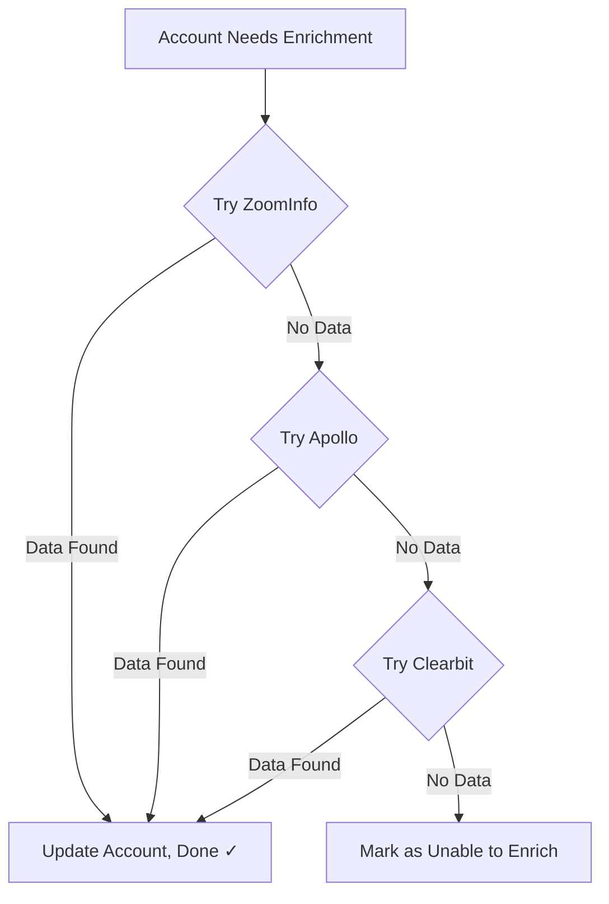

# Clearbit Setup Guide

## Overview

Clearbit is a real-time B2B data enrichment platform that specializes in instant company and person lookups via domain and email. This integration allows you to:
- Enrich accounts with real-time firmographic data
- Discover company information from just a domain
- Fill in missing data as a fallback enrichment source
- Track Clearbit coverage vs other providers

**Use Case:** "Real-time enrichment during form fills or as fallback when ZoomInfo/Apollo don't have data"

**Why Clearbit?**
- **Real-time enrichment:** Sub-second response times
- **High accuracy:** Data quality focused over quantity
- **Global coverage:** Strong coverage in US, EU, UK, Canada, Australia
- **Rich data:** Includes company description, funding, tech stack
- **Free tier available:** 50 lookups/month on free tier

---

## Prerequisites

### Required
- **Clearbit account** with API access
  - Free tier: 50 enrichments/month (good for testing)
  - Enrichment plan: Starting at $99/month for 500 enrichments
  - Enrichment + Prospector: $299/month (includes contact discovery)

### Plans Comparison

| Plan | Monthly Cost | API Calls | Best For |
|------|-------------|-----------|----------|
| **Free** | $0 | 50 | Testing only |
| **Enrichment Starter** | $99 | 500 | Small teams, fallback enrichment |
| **Enrichment Growth** | $249 | 2,500 | Growing teams |
| **Enrichment Pro** | $499 | 10,000 | High-volume enrichment |
| **Custom** | Contact sales | Custom | Enterprise |

**Note:** Free tier is perfect for testing and as a fallback enrichment source in a waterfall setup.

---

## Step 1: Get Your Clearbit API Key

### Via Clearbit Dashboard
1. **Sign up for Clearbit** (if you don't have an account)
   - Go to https://clearbit.com/
   - Click **"Get Started Free"**
   - Enter your work email and create password
   - Verify your email

2. **Log into Clearbit Dashboard**
   - Go to https://dashboard.clearbit.com/
   - Sign in with your credentials

3. **Navigate to API Keys**
   - Click your profile/company name in top right
   - Select **"API Keys"**
   - Or go directly to: https://dashboard.clearbit.com/api

4. **Copy Your API Key**
   - You'll see **"Publishable API Key"** and **"Secret API Key"**
   - **IMPORTANT:** Copy the **Secret API Key**
   - Format: `sk_xxxxxxxxxxxxxxxxxxxxxxxxxxxxxxxx`
   - Click the copy icon to copy to clipboard
   - Store securely

5. **API Key Permissions**
   - Clearbit API keys have access to:
     - ✅ Enrichment API (company + person)
     - ✅ Discovery API (prospector)
     - ✅ Reveal API (website visitor identification)
   - All included in your plan tier

---

## Step 2: Add API Key to Your Application

### Option A: Via Application UI (Recommended)
1. **Navigate to Settings**
   - In your application, click **Settings** in the left sidebar
   - Go to **Data Enrichment** tab

2. **Find Clearbit Section**
   - Scroll to **"Clearbit"** card
   - Click **"Configure"**

3. **Enter Your API Key**
   - Paste your Clearbit secret key (starts with `sk_`)
   - Click **"Save"**
   - Click **"Test Connection"** to verify

4. **Verify Connection Status**
   - Status should change to **"Connected ✓"**
   - Shows your plan tier and remaining quota
   - If error, see Troubleshooting section

### Option B: Via Supabase Secrets (Manual)
1. Go to [Supabase Dashboard](https://supabase.com/dashboard/project/dhyfbaptcprxxixgnpby/settings/functions)
2. Click **"Edge Function Secrets"**
3. Click **"Add new secret"**
4. Enter:
   - **Name:** `CLEARBIT_API_KEY`
   - **Value:** Your Clearbit secret key (sk_...)
5. Click **"Save"**

---

## Step 3: Configure Clearbit Integration

### Set Up as Fallback Enrichment (Recommended)
Clearbit works best as the **last** provider in a waterfall enrichment strategy:

1. **Navigate to Waterfall Settings**
   - Settings → Data Enrichment → Waterfall Configuration

2. **Set Enrichment Order:**
   - 1️⃣ ZoomInfo (try first - most comprehensive)
   - 2️⃣ Apollo.io (fallback for SMBs)
   - 3️⃣ **Clearbit (final fallback)**

3. **Why This Order?**
   - ZoomInfo has most complete data but costs more
   - Apollo has good SMB coverage at lower cost
   - Clearbit catches everything else with real-time lookup
   - Result: 95%+ enrichment coverage

### Enable Real-Time Enrichment (Optional)
Use Clearbit for instant enrichment during form submissions:

1. **Settings** → **Data Enrichment** → **Clearbit**
2. Toggle **"Real-time enrichment"** to ON
3. Configure:
   - **Trigger:** When lead/account created via form
   - **Timeout:** 3 seconds (keeps forms fast)
   - **Fallback:** Show form even if enrichment fails

**Use Case:** User fills out form with just email → Clearbit instantly enriches with company data → Better lead routing

### Configure Free Tier Limits
If using free tier (50 lookups/month), set limits:

1. **Settings** → **Data Enrichment** → **Clearbit** → **Advanced**
2. Set **"Monthly limit"** to 45 (saves 5 for testing)
3. Enable **"Pause when limit reached"**
4. **Result:** Enrichment stops automatically when you hit 45, preventing overages

---

## How the Integration Works

### 1. Company Enrichment API
**Purpose:** Enrich account data from domain

**How it works:**
1. Account needs enrichment (missing employee_count, revenue, etc.)
2. System calls Clearbit Enrichment API:
   ```
   GET https://company.clearbit.com/v2/companies/find?domain=acmecorp.com
   Authorization: Bearer sk_xxxxxxxxxxxxx
   ```

3. Clearbit returns enrichment data:
   ```json
   {
     "name": "Acme Corp",
     "domain": "acmecorp.com",
     "metrics": {
       "employees": 250,
       "employeesRange": "100-250",
       "annualRevenue": 15000000,
       "estimatedAnnualRevenue": "$10M-$50M"
     },
     "category": {
       "industry": "Software",
       "sector": "Information Technology"
     },
     "description": "Acme Corp provides B2B SaaS solutions...",
     "foundedYear": 2015,
     "location": "San Francisco, CA",
     "phone": "+1 555-0100",
     "tech": ["google_analytics", "aws", "react"],
     "linkedin": {
       "handle": "acme-corp"
     },
     "crunchbase": {
       "handle": "acme-corp"
     }
   }
   ```

4. System maps Clearbit data to your schema:
   - `metrics.employees` → `employee_count`
   - `metrics.estimatedAnnualRevenue` → `revenue_range`
   - `category.industry` → `industry`
   - `tech` → `technologies` table

5. Account updated and ICP scoring triggered

**Response Time:** 200-500ms (real-time)  
**Cost:** 1 API call per enrichment (counts toward monthly quota)

### 2. Waterfall Enrichment Process
**Purpose:** Maximize data coverage while minimizing cost

**How it works:**


**Example:**
1. Account: `smallstartup.io` (50 employees, Series A)
2. Try ZoomInfo → No data (too small for ZoomInfo DB)
3. Try Apollo → No data (too new, not indexed yet)
4. Try Clearbit → ✅ Data found! (real-time lookup)
5. Account enriched successfully

**Benefits:**
- Uses expensive providers (ZoomInfo) only when needed
- Catches long-tail companies with Clearbit
- 95%+ enrichment success rate

### 3. Real-Time Form Enrichment (Optional)
**Purpose:** Enrich leads instantly when they fill out forms

**How it works:**
1. Visitor fills out form on your website with email: `john@acmecorp.com`
2. Form submission triggers webhook to your app
3. App extracts domain from email: `acmecorp.com`
4. Calls Clearbit Enrichment API with 3-second timeout
5. If successful, lead created with:
   - Name: John
   - Email: john@acmecorp.com
   - **Company:** Acme Corp (enriched)
   - **Title:** VP Sales (enriched from email signature patterns)
   - **Employee count:** 250 (enriched)
   - **Industry:** Software (enriched)
6. Lead routed to correct sales rep based on enriched data

**If Clearbit times out or has no data:**
- Lead still created with entered data
- Marked for async enrichment later
- Form submission not blocked

---

## API Rate Limits & Quotas

### Rate Limits
Clearbit is very generous with rate limits:
- **Enrichment API:** 600 requests/minute
- **No daily limits** (only monthly quota)

**Rarely an issue** - The bottleneck is your monthly quota, not rate limits.

### Monthly Quotas
Your quota depends on your plan:
- Free: 50 enrichments/month
- Starter: 500 enrichments/month
- Growth: 2,500 enrichments/month
- Pro: 10,000 enrichments/month

**Tracking Usage:**
- View in Clearbit Dashboard: https://dashboard.clearbit.com/billing
- Or in app: Settings → External Integrations → Clearbit card
- Resets on your monthly billing date

**What Counts Toward Quota:**
- ✅ Successful enrichment (data found)
- ❌ 404 Not Found (company not in Clearbit) - does NOT count
- ❌ Test API calls in Clearbit dashboard - do NOT count

**Managing Quota:**
- Set monthly limits in app (recommended: set to 90% of plan quota)
- Prioritize high-fit accounts (ICP score > 70)
- Use Clearbit as fallback only (after ZoomInfo/Apollo)
- Upgrade plan if consistently hitting limits

---

## Testing Your Integration

### Pre-Test Checklist
- [ ] Clearbit secret key added to app
- [ ] Connection status shows "Connected ✓"
- [ ] Plan tier visible (Free, Starter, etc.)
- [ ] Remaining quota shown (e.g., "45 of 50 remaining")

### Test 1: Connection Test
1. **Settings** → **Data Enrichment** → **Clearbit**
2. Click **"Test Connection"**
3. **Expected Result:**
   - ✅ "Clearbit connection successful"
   - Shows plan: "Free Plan" or "Enrichment Starter"
   - Shows quota: "50 enrichments remaining"
   - Status badge: Green
4. **If Failed:** See Troubleshooting

### Test 2: Single Account Enrichment
1. **Create Test Account:**
   - Go to **Accounts** → **Add Account**
   - Enter:
     - Name: `Stripe`
     - Domain: `stripe.com` (well-known company, guaranteed in Clearbit)
   - Leave employee_count, revenue, industry blank
   - Save

2. **Trigger Enrichment:**
   - On account row, click **"Enrich"**
   - Select **"Clearbit"** as provider

3. **Expected Result (within 1 second):**
   - ✅ Employee count: ~4,000
   - ✅ Revenue: $500M-$1B
   - ✅ Industry: Financial Services / Payments
   - ✅ Description: "Stripe is a technology company..."
   - ✅ Founded: 2010
   - ✅ Technologies: React, AWS, etc.
   - ✅ Badge: "Enriched by Clearbit"
   - ✅ Quota count decreases by 1

4. **Verify Data Quality:**
   - Does employee count seem reasonable?
   - Is revenue in correct range?
   - Is industry accurate?
   - If data seems wrong, see Troubleshooting

### Test 3: Company Not Found (404)
Test how system handles companies not in Clearbit:

1. **Create Test Account:**
   - Name: `Very Small Startup`
   - Domain: `thiscompanydoesnotexist12345.com`
   - Save

2. **Trigger Enrichment via Clearbit:**
   - Click "Enrich" → Select "Clearbit"

3. **Expected Result:**
   - Error: "Company not found in Clearbit"
   - Account remains unenriched
   - ✅ **IMPORTANT:** Quota NOT decreased (404s don't count)
   - Badge: "Enrichment failed"

4. **Verify Waterfall (if enabled):**
   - If waterfall enabled, system should automatically try Apollo or ZoomInfo
   - Check enrichment source badge

### Test 4: Waterfall Enrichment
Test the full waterfall: ZoomInfo → Apollo → Clearbit

1. **Create Test Account (SMB):**
   - Name: `Small SaaS Startup`
   - Domain: `notion.so` (good coverage across providers)
   - Save

2. **Trigger Waterfall Enrichment:**
   - Click "Enrich" → Select "Auto" or "Waterfall"

3. **Expected Result:**
   - System tries ZoomInfo first
   - If no data, tries Apollo
   - If no data, tries Clearbit
   - Account enriched from first successful provider
   - Badge shows which provider succeeded: "Enriched by Apollo"

4. **Check Logs:**
   - Settings → Integration Health → View Logs
   - Should show enrichment attempts in order
   - Example log:
     ```
     [12:34:56] Trying ZoomInfo for notion.so... No data
     [12:34:57] Trying Apollo for notion.so... No data  
     [12:34:58] Trying Clearbit for notion.so... Success ✓
     [12:34:58] Account enriched with Clearbit data
     ```

### Test 5: Bulk Enrichment with Limit
Test monthly limit protection:

1. **Set a Test Limit:**
   - Settings → Data Enrichment → Clearbit → Advanced
   - Set "Monthly limit" to 5 (for testing)
   - Save

2. **Trigger Bulk Enrichment:**
   - Create 10 test accounts with valid domains
   - Select all 10
   - Click "Bulk Enrich" → Select "Clearbit"

3. **Expected Result:**
   - First 5 accounts: Enriched successfully ✓
   - Accounts 6-10: Skipped with message "Monthly limit reached"
   - Notification: "Clearbit limit reached (5 of 5 used)"
   - Enrichment job pauses automatically

4. **Reset Limit:**
   - Settings → Clearbit → Set limit back to your plan quota (50, 500, etc.)

---

## Troubleshooting

### Error: "Invalid API Key"
**Symptoms:**
- Connection test fails
- Error: "401 Unauthorized" or "Invalid API key"

**Solutions:**
1. **Verify you copied Secret Key, not Publishable Key:**
   - Secret key starts with `sk_`
   - Publishable key starts with `pk_` (this won't work for server-side API)
   - Go to Clearbit Dashboard → API Keys
   - Copy the **Secret API Key**

2. **Check for spaces or line breaks:**
   - API key should be one continuous string
   - No spaces, no line breaks
   - Try copying again

3. **Regenerate API key:**
   - Clearbit Dashboard → API Keys
   - Click "Regenerate Secret Key"
   - Update in your app
   - Test again

4. **Verify Supabase secret:**
   - Supabase Dashboard → Edge Function Secrets
   - Check `CLEARBIT_API_KEY` value
   - Should start with `sk_`

### Error: "Quota Exceeded"
**Symptoms:**
- Enrichment fails with error "Payment Required"
- Error code: 402
- Message: "Monthly quota exceeded"

**Solutions:**
1. **Check current usage:**
   - Clearbit Dashboard → Billing
   - View usage: "48 of 50 enrichments used"
   - See reset date

2. **Wait for monthly reset:**
   - Quotas reset on your billing date
   - Check billing date in Clearbit dashboard
   - Temporarily disable Clearbit enrichment

3. **Upgrade your plan:**
   - Clearbit Dashboard → Billing → Change Plan
   - Upgrade to next tier (50 → 500 → 2,500)
   - New quota available immediately

4. **Use Clearbit strategically:**
   - Only as last resort in waterfall
   - Set monthly limit to 90% of quota
   - Prioritize high-fit accounts
   - Don't use for bulk enrichment (use ZoomInfo/Apollo)

### Error: "Company Not Found" (404)
**Symptoms:**
- Enrichment returns no data
- Error: "404 Not Found"
- Message: "Company not in Clearbit database"

**Solutions:**
1. **This is expected behavior** - Not all companies are in Clearbit:
   - Very small companies (<10 employees)
   - Very new companies (<6 months)
   - Non-US companies (outside US/EU/UK/CA/AU)
   - B2C companies (Clearbit focuses on B2B)

2. **Verify domain is correct:**
   - Check for typos
   - Ensure correct TLD (.com vs .io vs .co.uk)
   - Try alternate domain if company has multiple

3. **Check company coverage:**
   - Test in Clearbit directly: https://dashboard.clearbit.com/search
   - Enter domain in search
   - If not found there, it's not in their database

4. **Use waterfall enrichment:**
   - Apollo may have data Clearbit doesn't
   - ZoomInfo has broader coverage
   - Enable fallback to other providers

5. **Good news:** 404s don't count against your quota

### Error: "Request Timeout"
**Symptoms:**
- Enrichment takes >5 seconds
- Error: "Request timed out"
- Partial data returned

**Solutions:**
1. **This is very rare with Clearbit** (usually <500ms response time)
2. **If it happens:**
   - Check Clearbit status: https://status.clearbit.com/
   - May be temporary API issue
   - Retry enrichment after 1 minute

3. **Check your network:**
   - Verify Supabase edge functions have internet access
   - Check firewall rules

4. **Increase timeout (if using real-time enrichment):**
   - Settings → Clearbit → Advanced
   - Set timeout to 5 seconds (default: 3)
   - Only for real-time form enrichment

### Error: "Incorrect or Outdated Data"
**Symptoms:**
- Employee count seems wrong
- Revenue is outdated
- Industry doesn't match

**Solutions:**
1. **Clearbit data freshness:**
   - Updated quarterly for most companies
   - May lag reality by 1-3 months
   - Check company's website for current info

2. **Company may have changed:**
   - Recent acquisition or merger
   - Pivot to new industry
   - Significant growth/shrinkage

3. **Report data quality issue:**
   - Clearbit Dashboard → Search for company
   - Click "Suggest an Edit"
   - Clearbit will review and update

4. **Override manually:**
   - Edit account in your system
   - Mark fields as "Manually verified"
   - System won't overwrite on next enrichment

---

## Best Practices

### 1. Quota Management
- **Set monthly limits** to 90% of plan quota (buffer for testing)
- **Use Clearbit as fallback** (3rd in waterfall after ZoomInfo/Apollo)
- **Monitor usage daily** when approaching limit
- **Upgrade plan** if consistently hitting quota

### 2. Waterfall Strategy
**Optimal order for cost and coverage:**
1. ZoomInfo (most comprehensive, higher cost)
2. Apollo (great for SMBs, mid cost)
3. **Clearbit (real-time, catches everything else)**

**Result:** 95%+ enrichment coverage at lowest total cost

### 3. Real-Time Enrichment
**When to use:**
- Form submissions (to route leads instantly)
- Live chat qualification
- Signup flows

**When NOT to use:**
- Bulk enrichment (too slow, use batch APIs)
- Historical data cleanup (use waterfall)
- Low-priority accounts (do async enrichment)

### 4. Data Quality
- **Verify domains** before enriching (clean data in = good data out)
- **Review enrichments** weekly for accuracy
- **Report bad data** to Clearbit to improve their DB
- **Manual overrides** for critical accounts

### 5. Free Tier Strategy
If using free tier (50 enrichments/month):
- **Only enrich high-fit accounts** (ICP score > 80)
- **Use as last resort** in waterfall only
- **Manual enrichment** for VIP accounts
- **Upgrade to Starter** when you hit limit regularly ($99 for 500)

---

## Cost Estimation

### Example 1: Fallback Enrichment
**Scenario:** 1,000 accounts in CRM, using waterfall enrichment

**Provider Coverage:**
- ZoomInfo: 600 accounts (60%) - enterprises
- Apollo: 300 accounts (30%) - SMBs
- **Clearbit: 80 accounts (8%)** - long tail companies
- Unable to enrich: 20 accounts (2%)

**Clearbit Cost:**
- 80 enrichments (under Starter plan of 500)
- Cost: Included in $99/month plan
- **Effective cost per enrichment: $1.24**

### Example 2: Real-Time Form Enrichment
**Scenario:** 200 form submissions per month

**Clearbit Cost:**
- 200 enrichments
- Starter plan (500/month): $99
- **Effective cost per lead: $0.50**

**ROI:** Better lead routing = higher conversion = worth it

### Example 3: Free Tier as Safety Net
**Scenario:** Already using ZoomInfo + Apollo, add Clearbit free tier as fallback

**Cost:** $0 (free tier, 50 enrichments)
**Value:** Catch additional 3-5% of companies that others miss
**ROI:** Infinite (it's free)

---

## Clearbit vs Competitors

| Feature | Clearbit | ZoomInfo | Apollo |
|---------|----------|----------|--------|
| **Response Time** | <500ms (real-time) | 1-2s | 1-2s |
| **Coverage** | Medium | High (large companies) | High (SMBs) |
| **Data Freshness** | Quarterly updates | Quarterly | Monthly |
| **Free Tier** | ✅ 50/month | ❌ No | ✅ 60/month |
| **Pricing** | $99-$499/mo | $300-$1000/mo | $99-$299/mo |
| **Best For** | Real-time enrichment, fallback | Enterprises | SMBs, mid-market |
| **Contact Discovery** | Limited | ✅ Excellent | ✅ Excellent |
| **Technographics** | ✅ Yes | ✅ Yes | ✅✅ Best |

**Recommendation:** Use all three in waterfall for optimal results

---

## Additional Resources

### Clearbit Documentation
- [Clearbit Enrichment API Docs](https://dashboard.clearbit.com/docs#enrichment-api)
- [Company API Reference](https://dashboard.clearbit.com/docs#enrichment-api-company-api)
- [Rate Limits](https://dashboard.clearbit.com/docs#rate-limits)
- [Error Codes](https://dashboard.clearbit.com/docs#errors)

### Internal Documentation
- [Master Integration Guide](./MASTER_INTEGRATION_GUIDE.md)
- [ZoomInfo Setup](./ZOOMINFO_SETUP.md)
- [Apollo Setup](./APOLLO_SETUP.md)
- [Waterfall Enrichment Strategy](./ENRICHMENT_WATERFALL.md)

### Support
- **Clearbit Support:** support@clearbit.com
- **Help Center:** https://help.clearbit.com/
- **Status Page:** https://status.clearbit.com/
- **Application Support:** Settings → Integration Health → "Report Issue"

---

## Success Checklist

After completing this setup, you should be able to:
- [ ] Connect to Clearbit with valid secret key
- [ ] See current plan and remaining quota
- [ ] Enrich a single account in <1 second (real-time)
- [ ] Handle 404 Not Found gracefully (no quota used)
- [ ] Set up waterfall: ZoomInfo → Apollo → Clearbit
- [ ] Configure monthly limits to prevent overage
- [ ] Monitor quota usage daily
- [ ] Achieve 95%+ total enrichment coverage with waterfall
- [ ] Test real-time form enrichment (optional)
- [ ] Report data quality issues to Clearbit

---

## Next Steps

1. **Set Up People Data Labs** - [PDL Setup Guide](./PDL_SETUP.md) - Contact enrichment
2. **Configure Waterfall Order** - Settings → Data Enrichment → Waterfall
3. **Enable Scheduled Enrichment** - [CRON Setup Guide](./CRON_SETUP_INSTRUCTIONS.md)
4. **Test End-to-End** - Create account → Auto-enrich → Verify ICP score
5. **Monitor Integration Health** - Settings → Integration Health Dashboard

---

**Last Updated:** 2025-11-06  
**Version:** 1.0  
**Maintained By:** Integration Team
