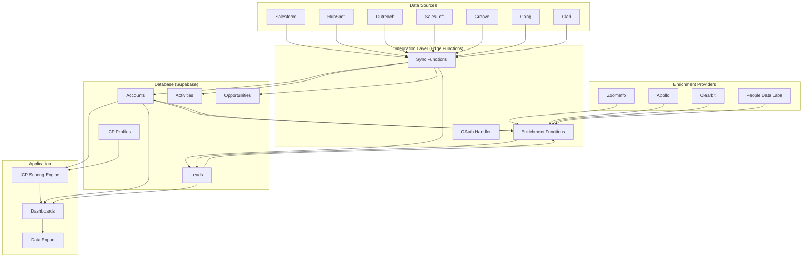

# Master Integration Guide

## Overview

This ICP Signal Platform supports 11+ integrations across 4 categories to provide comprehensive revenue intelligence and ICP scoring. This guide provides a complete overview of all integrations, recommended setup order, and architecture.

**Version:** 1.0  
**Last Updated:** 2025-11-06

---

## Table of Contents

1. [Integration Categories](#integration-categories)
2. [Quick Start Guide](#quick-start-guide)
3. [Recommended Setup Order](#recommended-setup-order)
4. [Integration Architecture](#integration-architecture)
5. [Data Flow Overview](#data-flow-overview)
6. [Feature Comparison Matrix](#feature-comparison-matrix)
7. [Best Practices](#best-practices)
8. [Common Use Cases](#common-use-cases)
9. [Support & Resources](#support--resources)

---

## Integration Categories

### 1. CRM Integrations (Core)
**Purpose:** Primary source of account, contact, and opportunity data

| Integration | Setup Guide | OAuth/API | Best For | Priority |
|-------------|-------------|-----------|----------|----------|
| **Salesforce** | [Setup Guide](./SALESFORCE_OAUTH_SETUP.md) | OAuth 2.0 | Enterprise, complex sales | **Critical** |
| **HubSpot** | [Setup Guide](./HUBSPOT_OAUTH_SETUP.md) | OAuth 2.0 / Private App | SMB, marketing-led | **Critical** |

**Key Features:**
- Real-time account and contact sync
- Opportunity pipeline tracking
- Webhook support for instant updates
- Custom field mapping
- Bi-directional sync (read/write)

**When to Use:**
- **Salesforce:** If you're an enterprise with complex sales processes
- **HubSpot:** If you're SMB-focused or marketing-led growth
- **Both:** If you have multiple GTM motions or subsidiaries

---

### 2. Data Enrichment (Foundation)
**Purpose:** Fill in missing firmographic data and calculate total addressable market

| Integration | Setup Guide | Auth Method | Best For | Cost |
|-------------|-------------|-------------|----------|------|
| **ZoomInfo** | [Setup Guide](./ZOOMINFO_SETUP.md) | API Key | Enterprises, US market | $$$ |
| **Apollo.io** | [Setup Guide](./APOLLO_SETUP.md) | API Key | SMBs, global coverage | $$ |
| **Clearbit** | [Setup Guide](./CLEARBIT_SETUP.md) | API Key | Real-time enrichment | $$ |
| **People Data Labs** | [Setup Guide](./PDL_SETUP.md) | API Key | Contact enrichment | $ |

**Key Features:**
- Total available count tracking (TAM calculation)
- Account enrichment (employee count, revenue, industry)
- Contact discovery at target accounts
- Waterfall enrichment (try multiple providers)
- Email verification

**Waterfall Strategy (Recommended):**
```
1. Try ZoomInfo first (most comprehensive)
   ↓ If no data
2. Try Apollo (good SMB coverage)
   ↓ If no data
3. Try Clearbit (real-time lookup)
   ↓ If no data
4. Try PDL (last resort)
   ↓ If no data
5. Mark as unable to enrich
```

**Result:** 95%+ enrichment coverage at optimal cost

---

### 3. Sales Engagement (Activity Intelligence)
**Purpose:** Track sales activities and account engagement

| Integration | Setup Guide | Auth Method | Best For | Native To |
|-------------|-------------|-------------|----------|-----------|
| **Outreach** | [Setup Guide](./OUTREACH_SETUP.md) | OAuth 2.0 | Standalone teams | Any CRM |
| **SalesLoft** | [Setup Guide](./SALESLOFT_SETUP.md) | OAuth 2.0 | Enterprise sales | Any CRM |
| **Groove** | [Setup Guide](./GROOVE_SETUP.md) | API Key / OAuth | Salesforce users | Salesforce |

**Key Features:**
- Activity tracking (emails, calls, meetings)
- Sequence/cadence enrollment monitoring
- Engagement scoring
- Rep performance analytics
- Meeting intelligence

**When to Use:**
- **Outreach:** If you use Outreach for sales engagement
- **SalesLoft:** If you use SalesLoft (popular with enterprises)
- **Groove:** If you're deeply integrated with Salesforce
- **Multiple:** You can connect multiple platforms simultaneously

---

### 4. Forecasting & Intelligence (Deal Intelligence)
**Purpose:** Revenue forecasting and conversation intelligence

| Integration | Setup Guide | Auth Method | Best For | Data Type |
|-------------|-------------|-------------|----------|-----------|
| **Gong** | [Setup Guide](./GONG_SETUP.md) | API Key | Call analysis | Conversation AI |
| **Clari** | [Setup Guide](./CLARI_SETUP.md) | API Token | Forecasting | Revenue ops |

**Key Features:**

**Gong:**
- Call and meeting recording analysis
- Sentiment analysis
- Topic tracking (pricing, competition, objections)
- Champion identification
- Risk signals

**Clari:**
- AI-powered forecast accuracy
- Deal health scoring
- Pipeline snapshots
- Conversion rate analytics
- Risk and momentum tracking

**When to Use:**
- **Gong:** If you want conversation intelligence and call insights
- **Clari:** If you want forecast accuracy and pipeline analytics
- **Both:** Complementary - Gong for qualitative, Clari for quantitative

---

## Quick Start Guide

### Minimum Viable Setup (1-2 hours)
**Goal:** Get basic ICP scoring working

1. **Connect CRM** (30-45 min)
   - Choose: Salesforce OR HubSpot
   - Follow setup guide
   - Trigger initial sync
   - Verify 100+ accounts imported

2. **Add 1 Enrichment Provider** (15-30 min)
   - Recommended: Apollo (good balance of coverage and cost)
   - Alternative: Clearbit (if you have it)
   - Test enrichment on 5 accounts
   - Verify data fills in (employee count, revenue)

3. **Define Your ICP** (15-30 min)
   - ICP Manager → Create ICP
   - Set criteria:
     - Industries
     - Company size range
     - Revenue range
     - Geography
   - Save and activate

4. **Trigger Bulk Scoring** (5 min + wait time)
   - Settings → Scoring → "Score All Accounts"
   - Wait 5-30 minutes depending on account count
   - Verify scores appear on accounts

**Result:** Working ICP scoring system with CRM data + enrichment

---

### Recommended Full Setup (1-2 weeks)

#### Week 1: Foundation
**Days 1-2: CRM Setup**
- Connect primary CRM (Salesforce or HubSpot)
- Configure custom field mappings
- Set up webhooks for real-time sync
- Enable scheduled sync (hourly)
- Verify data quality

**Days 3-4: Data Enrichment**
- Add ZoomInfo (if you have it) or Apollo
- Configure waterfall enrichment
- Add Clearbit as fallback
- Add PDL for contact enrichment
- Run bulk enrichment on all accounts
- Calculate total available market counts

**Day 5: ICP Definition**
- Create primary ICP with detailed criteria
- Upload closed-won deals for analysis
- Review AI-generated ICP recommendations
- Create 2-3 ICP variants for segments
- Validate ICP with sample matches

#### Week 2: Intelligence Layer
**Days 6-7: Sales Engagement**
- Connect Outreach, SalesLoft, or Groove
- Configure activity sync (emails, calls, meetings)
- Set up engagement scoring rules
- Backfill 90 days of historical activities

**Days 8-9: Forecasting & Intelligence**
- Connect Gong for conversation intelligence
- Connect Clari for forecast data
- Configure deal health scoring
- Set up risk signal alerts

**Day 10: Optimization**
- Review integration health dashboard
- Fine-tune field mappings
- Adjust enrichment waterfall order
- Configure automated workflows
- Train team on new system

---

## Recommended Setup Order

### Priority 1: Critical Path (Must Have)
These integrations are essential for basic functionality:

1. **CRM Integration** (Salesforce OR HubSpot)
   - **Why first:** Primary data source for accounts and opportunities
   - **Time:** 30-60 minutes
   - **Blocker for:** Everything else depends on CRM data

2. **Data Enrichment** (Apollo OR ZoomInfo)
   - **Why second:** Need firmographic data for ICP scoring
   - **Time:** 20-30 minutes
   - **Blocker for:** ICP scoring accuracy

3. **ICP Definition** (Not an integration, but critical)
   - **Why third:** Need ICP to score accounts
   - **Time:** 30-60 minutes
   - **Blocker for:** Meaningful scoring

### Priority 2: Enhanced Intelligence (Should Have)
Add these for comprehensive insights:

4. **Additional Enrichment Providers** (Clearbit + PDL)
   - **Why:** Increase enrichment coverage to 95%+
   - **Time:** 15 minutes each
   - **Depends on:** CRM data

5. **Sales Engagement** (Outreach/SalesLoft/Groove)
   - **Why:** Track active account engagement
   - **Time:** 30-45 minutes
   - **Depends on:** CRM data

### Priority 3: Advanced Intelligence (Nice to Have)
Add these for maximum insights:

6. **Gong** (Conversation Intelligence)
   - **Why:** Deep call insights and sentiment
   - **Time:** 30-45 minutes
   - **Depends on:** CRM data (for account matching)

7. **Clari** (Forecasting)
   - **Why:** Forecast accuracy and deal health
   - **Time:** 20-30 minutes
   - **Depends on:** CRM data with opportunities

---

## Integration Architecture

### High-Level Architecture



### Data Flow Sequence

**1. Initial CRM Sync → Account Creation**
```
Salesforce Account
  ↓
OAuth Callback
  ↓
sync-salesforce function
  ↓
Parse & normalize data
  ↓
Insert into accounts table
  ↓
Trigger: new account created
  ↓
Enqueue for enrichment
```

**2. Enrichment Waterfall**
```
Account with missing data
  ↓
Check enrichment queue
  ↓
Try ZoomInfo API
  ↓ (if no data)
Try Apollo API
  ↓ (if no data)
Try Clearbit API
  ↓ (if no data)
Try PDL API
  ↓
Update account with enriched data
  ↓
Mark enrichment complete
  ↓
Trigger ICP scoring
```

**3. ICP Scoring**
```
Account (enriched)
  ↓
Load active ICP profiles
  ↓
Calculate match score per ICP
  ↓
Apply firmographic scoring rules
  ↓
Apply engagement bonuses (if sales engagement data)
  ↓
Apply forecast bonuses (if Clari data)
  ↓
Apply call intelligence (if Gong data)
  ↓
Store final ICP score
  ↓
Update account record
  ↓
Refresh dashboard views
```

**4. Activity Enrichment (Sales Engagement)**
```
Outreach Email Sent
  ↓
Webhook received
  ↓
outreach-webhook function
  ↓
Parse activity data
  ↓
Match to Account & Lead
  ↓
Insert into activities table
  ↓
Update account engagement score
  ↓
Update last activity timestamp
  ↓
Recalculate ICP score (with engagement bonus)
```

---

## Feature Comparison Matrix

### CRM Integrations: Salesforce vs HubSpot

| Feature | Salesforce | HubSpot |
|---------|-----------|---------|
| **Account Sync** | ✅ Excellent | ✅ Excellent |
| **Contact Sync** | ✅ Excellent | ✅ Excellent |
| **Opportunity Sync** | ✅ Excellent | ✅ Good (Deals) |
| **Custom Fields** | ✅✅ Unlimited | ✅ Limited by plan |
| **Webhooks** | ✅ Outbound Messages | ✅ Workflows |
| **Real-time Sync** | ✅ Yes | ✅ Yes |
| **Historical Data** | ✅ Unlimited | ✅ Unlimited |
| **Best For** | Enterprise, complex | SMB, marketing-led |
| **Setup Complexity** | Medium (OAuth) | Easy (Private App) |

### Data Enrichment: Provider Comparison

| Feature | ZoomInfo | Apollo | Clearbit | PDL |
|---------|----------|--------|----------|-----|
| **Company Data** | ✅✅ Best | ✅ Good | ✅ Good | ⚠️ Basic |
| **Contact Data** | ✅ Good | ✅ Good | ⚠️ Limited | ✅✅ Best |
| **US Coverage** | ✅✅ Best | ✅ Good | ✅ Good | ✅ Good |
| **Global Coverage** | ✅ Good | ✅✅ Best | ✅ Good | ✅ Good |
| **SMB Coverage** | ⚠️ Limited | ✅✅ Best | ✅ Good | ✅ Good |
| **Enterprise Coverage** | ✅✅ Best | ✅ Good | ✅ Good | ✅ Good |
| **Technographics** | ✅ Yes | ✅✅ Best | ✅ Yes | ✅ Yes |
| **Real-time** | ⚠️ Slow | ⚠️ Slow | ✅✅ Fast (<500ms) | ✅ Fast |
| **Free Tier** | ❌ No | ✅ 60/mo | ✅ 50/mo | ✅ 1000 |
| **Cost/Enrichment** | $$$ ($0.50) | $$ ($0.10) | $$ ($0.20) | $ ($0.015) |
| **Best For** | Enterprises | SMBs | Real-time | Contact data |

### Sales Engagement: Platform Comparison

| Feature | Outreach | SalesLoft | Groove |
|---------|----------|-----------|--------|
| **Activity Tracking** | ✅✅ Excellent | ✅✅ Excellent | ✅ Good |
| **Sequences/Cadences** | ✅ Sequences | ✅ Cadences | ✅ Flows |
| **Email Tracking** | ✅ Yes | ✅ Yes | ✅ Yes |
| **Call Logging** | ✅ Yes | ✅ Yes | ✅ Yes |
| **Meeting Scheduling** | ✅ Yes | ✅ Yes | ✅ Yes |
| **Analytics** | ✅✅ Excellent | ✅✅ Excellent | ✅ Good |
| **CRM Native** | ❌ No | ❌ No | ✅ Salesforce only |
| **API Maturity** | ✅✅ Excellent | ✅✅ Excellent | ⚠️ Good |
| **Webhooks** | ✅ Yes | ✅ Yes | ⚠️ Limited |
| **Best For** | Any CRM | Enterprise | Salesforce users |

### Intelligence: Gong vs Clari

| Feature | Gong | Clari |
|---------|------|-------|
| **Primary Focus** | Conversation Intelligence | Revenue Forecasting |
| **Call Recording** | ✅✅ Core feature | ❌ No |
| **Transcript Analysis** | ✅✅ AI-powered | ❌ No |
| **Sentiment Analysis** | ✅ Yes | ⚠️ Basic |
| **Topic Tracking** | ✅✅ Excellent | ❌ No |
| **Deal Health** | ✅ From calls | ✅✅ From all data |
| **Forecasting** | ⚠️ Basic | ✅✅ Core feature |
| **Pipeline Analytics** | ⚠️ Limited | ✅✅ Excellent |
| **Risk Signals** | ✅ From conversations | ✅ From pipeline data |
| **Best For** | Call insights | Revenue ops |
| **Complementary?** | ✅ Yes - use both | ✅ Yes - use both |

---

## Best Practices

### 1. Setup Order Matters
**Do this:**
✅ Set up CRM first (foundational data)
✅ Add enrichment second (complete the data)
✅ Define ICP third (ready to score)
✅ Add intelligence layers fourth (optimize)

**Don't do this:**
❌ Try to set up all 11 integrations at once
❌ Define ICP before you have data
❌ Skip enrichment and try to score incomplete data

### 2. Data Quality Before Quantity
**Do this:**
✅ Clean your CRM data first (dedupe, normalize)
✅ Map custom fields properly
✅ Test with small batches (10-100 accounts)
✅ Verify data quality before bulk operations

**Don't do this:**
❌ Sync everything before cleaning data
❌ Skip field mapping and hope for the best
❌ Run bulk enrichment on 10,000 accounts without testing

### 3. Use Waterfall Enrichment
**Do this:**
✅ Set up multiple enrichment providers
✅ Order by: cost, coverage, specialization
✅ Try expensive providers first, cheaper ones as fallback
✅ Track which provider enriched each account

**Don't do this:**
❌ Use only one enrichment provider
❌ Try cheapest provider first (wastes API calls)
❌ Enrich everything with expensive provider

### 4. Monitor Integration Health
**Do this:**
✅ Check Integration Health dashboard weekly
✅ Review sync logs for errors
✅ Monitor API rate limits
✅ Set up alerts for integration failures

**Don't do this:**
❌ Set and forget integrations
❌ Ignore error notifications
❌ Let credentials expire without renewal

### 5. Incremental Sync Strategy
**Do this:**
✅ Use webhooks for real-time updates (when available)
✅ Schedule regular incremental syncs (hourly/daily)
✅ Only fetch changed data (use `updatedAt` filters)
✅ Run full syncs weekly/monthly for data integrity

**Don't do this:**
❌ Fetch all data every sync (wastes API calls)
❌ Sync only manually (data gets stale)
❌ Never run full syncs (data drift accumulates)

---

## Common Use Cases

### Use Case 1: Enterprise B2B SaaS
**Goal:** Identify high-fit enterprise accounts and track deal progress

**Recommended Stack:**
- **CRM:** Salesforce (complex sales cycles)
- **Enrichment:** ZoomInfo + Apollo (waterfall)
- **Sales Engagement:** Outreach or SalesLoft
- **Intelligence:** Gong + Clari (full visibility)

**Setup Time:** 2-3 days  
**Monthly Cost:** $1,500-$3,000 (tool subscriptions)

**ICP Criteria:**
- Company size: 1,000-10,000 employees
- Revenue: $100M-$1B
- Industries: Technology, Financial Services
- Geographies: US, UK, Canada

**Workflow:**
1. Salesforce syncs accounts hourly
2. ZoomInfo enriches missing data (try first)
3. Apollo fills in what ZoomInfo missed
4. ICP scoring identifies high-fit accounts (70+ score)
5. Outreach tracks sales engagement
6. Gong analyzes discovery calls
7. Clari forecasts deal closure
8. High-scoring + engaged + forecasted = top priority

---

### Use Case 2: SMB-Focused Startup
**Goal:** Find and engage SMB accounts cost-effectively

**Recommended Stack:**
- **CRM:** HubSpot (marketing-led growth)
- **Enrichment:** Apollo + Clearbit (SMB coverage)
- **Sales Engagement:** SalesLoft or Groove
- **Intelligence:** Optional (focus on core first)

**Setup Time:** 1-2 days  
**Monthly Cost:** $400-$800

**ICP Criteria:**
- Company size: 10-200 employees
- Revenue: $1M-$50M
- Industries: SaaS, E-commerce, Professional Services
- Geographies: US, Canada, UK, Australia

**Workflow:**
1. HubSpot syncs accounts and contacts
2. Apollo enriches (best SMB coverage)
3. Clearbit fills gaps with real-time lookup
4. ICP scoring prioritizes SMB accounts
5. SalesLoft automates outreach sequences
6. Focus on accounts with 60+ ICP score + active engagement

---

### Use Case 3: Multi-Product Company
**Goal:** Score accounts differently for each product line

**Recommended Stack:**
- **CRM:** Salesforce (handles complexity)
- **Enrichment:** Full waterfall (ZoomInfo → Apollo → Clearbit → PDL)
- **Sales Engagement:** Outreach (multi-team)
- **Intelligence:** Gong + Clari

**Setup Time:** 1-2 weeks  
**Monthly Cost:** $2,000-$4,000

**ICP Strategy:**
- Create separate ICP for each product:
  - Product A: Enterprise ICP
  - Product B: SMB ICP
  - Product C: Mid-market ICP
- Tag accounts with "best fit product"
- Route to appropriate sales team

**Workflow:**
1. Salesforce syncs all accounts
2. Full waterfall enrichment for complete data
3. Score against all 3 ICPs simultaneously
4. Tag account with highest-scoring product
5. Route to product-specific sales team
6. Track engagement and forecast by product line

---

### Use Case 4: Freemium Product → Paid Conversion
**Goal:** Identify which free users to prioritize for sales outreach

**Recommended Stack:**
- **CRM:** HubSpot (tracks product usage)
- **Enrichment:** Clearbit + PDL (real-time user enrichment)
- **Sales Engagement:** Optional initially
- **Intelligence:** Focus on product analytics first

**Setup Time:** 1-2 days  
**Monthly Cost:** $200-$500

**ICP Criteria:**
- Company size: 50-500 employees
- Industries: Technology, SaaS
- Geographies: Global
- **Plus:** Product usage signals (power users, feature adoption)

**Workflow:**
1. User signs up for free product
2. Clearbit enriches from email domain (real-time)
3. PDL enriches contact details
4. Calculate ICP score + product usage score
5. High ICP + High usage = "Product Qualified Lead"
6. Route to sales for outreach

---

## Support & Resources

### Integration-Specific Documentation
- [Salesforce OAuth Setup](./SALESFORCE_OAUTH_SETUP.md)
- [HubSpot OAuth Setup](./HUBSPOT_OAUTH_SETUP.md)
- [ZoomInfo Setup](./ZOOMINFO_SETUP.md)
- [Apollo Setup](./APOLLO_SETUP.md)
- [Clearbit Setup](./CLEARBIT_SETUP.md)
- [People Data Labs Setup](./PDL_SETUP.md)
- [Outreach Setup](./OUTREACH_SETUP.md)
- [SalesLoft Setup](./SALESLOFT_SETUP.md)
- [Groove Setup](./GROOVE_SETUP.md)
- [Gong Setup](./GONG_SETUP.md)
- [Clari Setup](./CLARI_SETUP.md)

### Cross-Integration Documentation
- [Troubleshooting Guide](./TROUBLESHOOTING_INTEGRATIONS.md)
- [Field Mapping Guide](./FIELD_MAPPING_GUIDE.md)
- [CRM Sync Guide](./CRM_SYNC_GUIDE.md)

### Getting Help
1. **Integration Health Dashboard:** Settings → Integration Health
2. **Sync Logs:** View detailed logs for each integration
3. **Webhook Activity:** Monitor real-time webhook events
4. **Error Reports:** Automatic error tracking and alerts

---

## Appendix

### Integration Health Checklist

#### Daily
- [ ] Check Integration Health dashboard
- [ ] Review sync success rate (should be >95%)
- [ ] Monitor API rate limit usage (<80% of limit)

#### Weekly
- [ ] Review enrichment coverage (should be >85%)
- [ ] Check for failed syncs and retry
- [ ] Verify webhook delivery (if using webhooks)
- [ ] Review data quality metrics

#### Monthly
- [ ] Audit field mappings for accuracy
- [ ] Review API credit usage vs budget
- [ ] Update enrichment waterfall order based on performance
- [ ] Rotate API keys/credentials for security
- [ ] Full reconciliation sync (compare CRM to database)

---

**Questions or issues?** Check the [Troubleshooting Guide](./TROUBLESHOOTING_INTEGRATIONS.md) or contact support.

---

**Last Updated:** 2025-11-06  
**Maintained By:** Integration Team  
**Version:** 1.0
