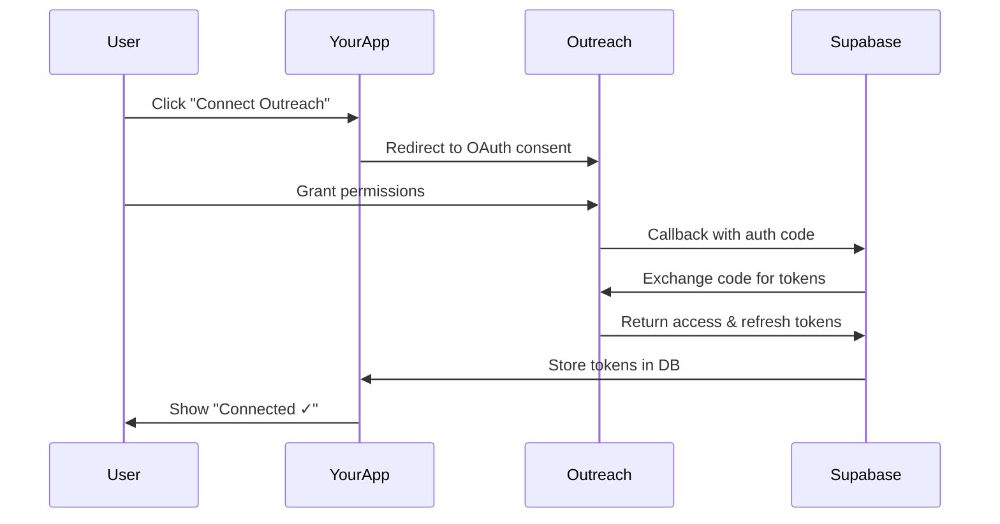

# Outreach Setup Guide

## Overview

Outreach is a leading sales engagement platform that helps sales teams manage sequences, track activities, and analyze outreach performance. This integration allows you to:
- Sync sales activities (emails, calls, meetings) to your application
- Track sequence enrollment and engagement
- Import contact interactions for ICP scoring
- Monitor sales rep performance metrics

**Use Case:** "Track which accounts are actively being worked by sales and their engagement levels"

**Why Outreach?**
- **Activity tracking:** Complete history of all touchpoints
- **Sequence data:** See which accounts are in active sequences
- **Engagement metrics:** Email opens, clicks, replies
- **Meeting intelligence:** Sync scheduled and completed meetings
- **Rep attribution:** Track which rep is working each account

---

## Prerequisites

### Required
- **Active Outreach account** with admin access
  - Professional or Enterprise plan (API access required)
  - Admin or Developer role to create OAuth apps
- **Outreach subdomain:** Your unique Outreach URL (e.g., `yourcompany.outreach.io`)

### Verify Your Access
1. Log into Outreach at `https://yourcompany.outreach.io`
2. Click your profile picture (bottom left)
3. Go to **Settings** → **Integrations** → **API**
4. If you see "API access not available", contact your Outreach admin or upgrade your plan

---

## Step 1: Create OAuth Application in Outreach

### Navigate to OAuth Apps
1. **Log into Outreach** at `https://yourcompany.outreach.io`
2. Click your **profile picture** (bottom left corner)
3. Select **Settings**
4. In the left sidebar, navigate to:
   - **Platform** section
   - Click **API** (or **Integrations** → **API**)
   - Click **OAuth Applications**

### Create New Application
1. Click **"+ New OAuth Application"** button

2. **Fill in Application Details:**

   **Basic Information:**
   - **Name:** `ICP Signal Platform Integration`
   - **Description:** `Integration for tracking sales activities and account engagement`
   - **Application Type:** Select **"Web Application"**

   **Redirect URIs:**
   - Add this exact URL: `https://dhyfbaptcprxxixgnpby.supabase.co/functions/v1/oauth-callback`
   - **CRITICAL:** Make sure there are no trailing slashes
   - **CRITICAL:** Must be `https://` (not `http://`)

   **Scopes (Permissions):**
   Select the following scopes - these determine what data you can access:
   
   ✅ **Accounts:**
   - `accounts.read` - View account information
   - `accounts.write` - Update account information (optional)
   
   ✅ **Prospects (Contacts):**
   - `prospects.read` - View contact/lead information
   - `prospects.write` - Update contacts (optional)
   
   ✅ **Sequences:**
   - `sequences.read` - View sequence information
   - `sequenceStates.read` - View who's enrolled in sequences
   
   ✅ **Activities:**
   - `calls.read` - View call activities
   - `emails.read` - View email activities (opens, clicks, replies)
   - `tasks.read` - View task activities
   - `meetings.read` - View meeting activities
   
   ✅ **Users:**
   - `users.read` - View sales rep information

   **Logo (Optional):**
   - Upload your company logo (recommended for user trust)
   - Appears in OAuth consent screen

3. **Click "Create Application"**

### Copy OAuth Credentials
After creating the application, you'll see:

1. **Application ID** (or Client ID)
   - Format: `xxxxxxxxxxxxxxxxxxxxxxxxxxxxxxxx`
   - Copy this - you'll need it for Supabase secrets

2. **Secret** (or Client Secret)
   - Format: `yyyyyyyyyyyyyyyyyyyyyyyyyyyyyyyy`
   - **IMPORTANT:** Copy immediately - you may not be able to see it again
   - If you lose it, you can regenerate (but will need to reconfigure integration)

3. **Save these credentials securely** - you'll add them in Step 2

---

## Step 2: Add OAuth Credentials to Your Application

### Option A: Via Application UI (Recommended)
1. **Navigate to Settings**
   - In your application, click **Settings** in the left sidebar
   - Go to **External Integrations** tab

2. **Find Outreach Section**
   - Scroll to **"Outreach"** card
   - Click **"Connect"**

3. **Enter OAuth Credentials**
   - **Client ID:** Paste the Application ID from Outreach
   - **Client Secret:** Paste the Secret from Outreach
   - **Outreach Subdomain:** Enter your subdomain (e.g., `yourcompany`)
     - Just the subdomain, NOT the full URL
     - Example: If your URL is `acme.outreach.io`, enter `acme`
   - Click **"Save"**

4. **Initiate OAuth Flow**
   - Click **"Authorize with Outreach"**
   - You'll be redirected to Outreach login
   - Grant permissions
   - Redirected back to your application
   - Status should show **"Connected ✓"**

### Option B: Via Supabase Secrets (Manual)
1. Go to [Supabase Dashboard](https://supabase.com/dashboard/project/dhyfbaptcprxxixgnpby/settings/functions)
2. Click **"Edge Function Secrets"**
3. Add these secrets:
   - **Name:** `OUTREACH_CLIENT_ID`
   - **Value:** Your Outreach Application ID
   - Click "Save"
   
   - **Name:** `OUTREACH_CLIENT_SECRET`
   - **Value:** Your Outreach Secret
   - Click "Save"

4. Then complete OAuth flow in application UI (Step 2A, point 4)

---

## Step 3: Configure Outreach Integration

### Set Sync Preferences
1. **Settings** → **External Integrations** → **Outreach**
2. Configure what data to sync:

   **Activities to Sync:**
   - ✅ Email activities (sent, opened, clicked, replied)
   - ✅ Call activities (attempted, completed, duration)
   - ✅ Meeting activities (scheduled, completed)
   - ⚠️ Tasks (optional - can be noisy)

   **Sync Frequency:**
   - **Real-time:** Via webhooks (recommended, if available)
   - **Hourly:** Good for most teams
   - **Daily:** For low-volume teams
   - **Manual:** Only sync on demand

   **Activity Lookback:**
   - Last 90 days (default)
   - Custom date range if needed

### Map Outreach Data to Your Schema
1. **Settings** → **External Integrations** → **Outreach** → **Field Mapping**

2. **Standard Mappings (automatic):**
   - Outreach Account → Your Account (by domain or name)
   - Outreach Prospect → Your Lead (by email)
   - Outreach User (rep) → Your User (by email)

3. **Custom Field Mapping (if needed):**
   - Map Outreach custom fields to your schema
   - Example: Outreach `account.industry` → Your `industry`

### Enable Activity Scoring (Optional)
Bonus ICP points for accounts with high engagement:

1. **Settings** → **Scoring Configuration** → **Engagement Signals**
2. Configure engagement scoring:
   - Email reply: +5 points
   - Meeting scheduled: +10 points
   - Meeting completed: +15 points
   - Call completed: +5 points
   - Sequence progression: +3 points per stage

---

## How the Integration Works

### 1. OAuth Authentication Flow
**Purpose:** Securely connect to your Outreach account

**How it works:**


**Tokens stored:**
- Access token (expires in 2 hours)
- Refresh token (used to get new access token)
- Stored securely in `integration_configs` table

### 2. Activity Sync Process
**Purpose:** Import sales activities to track account engagement

**How it works:**
1. **Scheduled Job Runs** (hourly/daily)
2. **Fetch Recent Activities:**
   ```
   GET https://api.outreach.io/api/v2/emailMessages
   ?filter[createdAt][gte]=2024-01-01T00:00:00Z
   &page[limit]=100
   ```

3. **Outreach Returns Activities:**
   ```json
   {
     "data": [
       {
         "id": "123",
         "type": "emailMessage",
         "attributes": {
           "subject": "Follow-up on demo",
           "state": "delivered",
           "deliveredAt": "2024-01-15T10:30:00Z",
           "openedAt": "2024-01-15T10:45:00Z",
           "clickedAt": "2024-01-15T10:47:00Z",
           "repliedAt": "2024-01-15T11:00:00Z"
         },
         "relationships": {
           "prospect": { "data": { "id": "456" } },
           "account": { "data": { "id": "789" } },
           "owner": { "data": { "id": "101" } }
         }
       }
     ]
   }
   ```

4. **System Processes Activities:**
   - Matches Outreach Account to your Account (by domain)
   - Matches Outreach Prospect to your Lead (by email)
   - Creates activity record in your database
   - Updates account engagement score

5. **Activity Stored in Database:**
   ```sql
   INSERT INTO activities (
     account_id,
     lead_id,
     activity_type,
     activity_date,
     data_source,
     metadata
   ) VALUES (
     'account-uuid',
     'lead-uuid',
     'email_reply',
     '2024-01-15T11:00:00Z',
     'outreach',
     '{"subject": "Follow-up on demo", "opened": true, "clicked": true}'
   );
   ```

6. **Update Account Engagement:**
   - Calculate engagement score from activities
   - Add bonus ICP points for high engagement
   - Update last activity date
   - Flag account as "actively being worked"

### 3. Sequence Enrollment Tracking
**Purpose:** See which accounts are in active sales sequences

**How it works:**
1. **Fetch Sequence States:**
   ```
   GET https://api.outreach.io/api/v2/sequenceStates
   ?filter[state]=active
   ```

2. **Outreach Returns Active Enrollments:**
   ```json
   {
     "data": [
       {
         "id": "seq-state-1",
         "attributes": {
           "state": "active",
           "sequenceStep": 3,
           "totalSteps": 10,
           "createdAt": "2024-01-10T00:00:00Z"
         },
         "relationships": {
           "prospect": { "data": { "id": "456" } },
           "sequence": { "data": { "id": "seq-101" } }
         }
       }
     ]
   }
   ```

3. **System Updates Account Status:**
   - Mark account as "In Sequence"
   - Show sequence name and current step
   - Calculate sequence engagement (response rate)
   - Display on account detail page

### 4. Meeting Sync
**Purpose:** Track meetings scheduled and completed

**How it works:**
1. **Fetch Meetings:**
   ```
   GET https://api.outreach.io/api/v2/meetings
   ?filter[startAt][gte]=2024-01-01
   ```

2. **Process Meeting Data:**
   - Scheduled meetings → Calendar events in your app
   - Completed meetings → Activity records
   - No-shows → Flag for follow-up
   - Add bonus ICP points for completed meetings

---

## API Rate Limits

### Outreach Rate Limits
- **Rate limit:** 10,000 requests/hour per org
- **Burst limit:** 100 requests/10 seconds
- **Per user limits:** 1,000 requests/hour per user token

### Handling Rate Limits
- Built-in exponential backoff
- Batch processing for bulk data
- Automatic retry on 429 errors
- Monitor usage in Outreach Settings → API

**Best Practices:**
- Schedule syncs during off-peak hours (overnight)
- Use incremental sync (only new data since last sync)
- Enable pagination (100 records per page)

---

## Testing Your Integration

### Pre-Test Checklist
- [ ] OAuth credentials added to application
- [ ] Successfully completed OAuth flow
- [ ] Connection status shows "Connected ✓"
- [ ] At least 1 account in Outreach with activities

### Test 1: OAuth Connection
1. **Settings** → **External Integrations** → **Outreach**
2. Click **"Test Connection"**
3. **Expected Result:**
   - ✅ "Outreach connection successful"
   - Shows your Outreach subdomain
   - Status badge: Green "Connected"
   - Last synced timestamp visible
4. **If Failed:** See Troubleshooting section

### Test 2: Sync Activities
1. **Create Test Activity in Outreach:**
   - Send an email to a prospect
   - Or log a call manually
   - Wait 2-3 minutes for Outreach to process

2. **Trigger Manual Sync:**
   - Settings → External Integrations → Outreach
   - Click **"Sync Now"**

3. **Expected Result:**
   - Progress: "Syncing activities from Outreach..."
   - After 10-30 seconds: "Synced 5 activities"
   - Check **Activities** page in your app
   - See the email/call you just logged

4. **Verify Activity Details:**
   - Click on the activity
   - Should show: Type, Date, Rep, Account, Prospect
   - Metadata: Subject (emails), Duration (calls)
   - Source: "Outreach"

### Test 3: Sequence Enrollment
1. **Enroll a Prospect in Outreach:**
   - In Outreach, add a prospect to any sequence
   - Note the account domain

2. **Sync Sequence Data:**
   - Your App → Settings → Outreach → "Sync Sequences"

3. **Expected Result:**
   - Go to **Accounts** page
   - Find the account by domain
   - Should show badge: "In Sequence: [Sequence Name]"
   - Click account → "Outreach" tab
   - See: Current step, Total steps, Enrollment date

### Test 4: Meeting Sync
1. **Schedule Meeting in Outreach:**
   - Create a meeting with a prospect
   - Set future date/time

2. **Trigger Sync:**
   - Settings → Outreach → "Sync Meetings"

3. **Expected Result:**
   - Meeting appears in your app's calendar view
   - Shows: Title, Date/Time, Attendees, Account
   - Click meeting → See full details

4. **Mark Meeting Completed in Outreach:**
   - In Outreach, mark meeting as completed
   - Sync again

5. **Verify Update:**
   - Meeting status changes to "Completed"
   - Account gets +15 ICP bonus points
   - Activity record created

### Test 5: Account Engagement Scoring
1. **Create Multiple Activities:**
   - Send 3 emails (1 opened, 1 clicked, 1 replied)
   - Log 1 call (completed)
   - Schedule 1 meeting

2. **Trigger Full Sync:**
   - Settings → Outreach → "Sync Now"

3. **Check Account Score:**
   - Go to account detail page
   - View "Engagement Score" section
   - Should show breakdown:
     - Email sent: +0 points
     - Email opened: +2 points
     - Email clicked: +3 points
     - Email reply: +5 points
     - Call completed: +5 points
     - Meeting scheduled: +10 points
     - **Total: +25 engagement points**

4. **Verify ICP Score Updated:**
   - Original ICP score: 65
   - With engagement bonus: 90 (65 + 25)
   - Account moves to "High Fit" category

---

## Troubleshooting

### Error: "OAuth Authorization Failed"
**Symptoms:**
- Redirected back to app with error
- Message: "Authorization denied" or "Invalid request"

**Solutions:**
1. **Verify Redirect URI matches exactly:**
   - Outreach OAuth App settings
   - Should be: `https://dhyfbaptcprxxixgnpby.supabase.co/functions/v1/oauth-callback`
   - No trailing slashes
   - Must be `https://` not `http://`

2. **Check scopes are correct:**
   - Outreach OAuth App → Scopes
   - Ensure all required scopes are selected (see Step 1)

3. **Verify Client ID and Secret:**
   - Copy from Outreach again
   - Update in Settings → Outreach
   - Retry OAuth flow

4. **Check user permissions:**
   - Must have admin or developer role in Outreach
   - Contact your Outreach admin if needed

### Error: "Access Token Expired"
**Symptoms:**
- Sync fails with "401 Unauthorized"
- Message: "Token has expired"

**Solutions:**
1. **This is expected behavior** - Tokens expire every 2 hours
2. **System should auto-refresh:**
   - Check refresh token is stored in database
   - Edge function automatically refreshes tokens
3. **If auto-refresh fails:**
   - Settings → Outreach → Click "Reconnect"
   - Complete OAuth flow again
   - New tokens issued

### Error: "Rate Limit Exceeded"
**Symptoms:**
- Sync fails partway through
- Error: "429 Too Many Requests"
- Message: "Rate limit exceeded, retry after X seconds"

**Solutions:**
1. **System will auto-retry** - No action needed
2. **If persistent:**
   - Check if other integrations are using Outreach API
   - Reduce sync frequency to "Daily"
   - Contact Outreach support to increase rate limit

3. **Monitor API usage:**
   - Outreach → Settings → API → Usage
   - See hourly/daily request counts
   - Identify which endpoints are hitting limits

### Error: "Account/Prospect Not Found"
**Symptoms:**
- Activities synced but not linked to accounts
- Message: "Could not match Outreach account to internal account"

**Solutions:**
1. **Verify domain matching:**
   - Outreach Account domain: `acmecorp.com`
   - Your Account domain: Must match exactly
   - Update account domain if needed

2. **Check account exists:**
   - Outreach account may be new
   - Run CRM sync first to import account
   - Then run Outreach sync

3. **Manual matching:**
   - Settings → Data Mapping → Account Matching
   - Manually link Outreach accounts to your accounts
   - Use account name if domain doesn't match

### Error: "Webhook Delivery Failed"
**Symptoms:**
- Real-time sync not working
- Webhooks show "Failed" status in Outreach

**Solutions:**
1. **Verify webhook endpoint:**
   - Should be: `https://dhyfbaptcprxxixgnpby.supabase.co/functions/v1/outreach-webhook`
   - Check Outreach → Settings → Webhooks

2. **Check endpoint is accessible:**
   - Test with curl or Postman
   - Should return 200 OK

3. **Review webhook logs:**
   - Supabase → Functions → `outreach-webhook` → Logs
   - Look for errors
   - Common issue: Missing auth headers

---

## Best Practices

### 1. Sync Strategy
- **Real-time webhooks:** Best for immediate updates (if available)
- **Hourly sync:** Good balance of freshness and API usage
- **Daily sync:** Sufficient for most teams, lowest API usage
- **Incremental sync:** Only fetch data since last sync (saves API calls)

### 2. Activity Filtering
**Sync only relevant activities:**
- ✅ Emails sent/replied
- ✅ Calls completed (not attempted)
- ✅ Meetings scheduled/completed
- ❌ Tasks (too granular, noisy)
- ❌ Email bounces (not useful for ICP scoring)

### 3. Engagement Scoring
**Assign point values based on your sales process:**
- Email reply: +5 (high intent)
- Meeting completed: +15 (highest intent)
- Call completed: +5 (medium intent)
- Email opened: +2 (low intent)
- Sequence progression: +3 per stage

**Decay engagement over time:**
- Activities >90 days old: 50% weight
- Activities >180 days old: 0% weight (ignore)

### 4. Account Attribution
**Track which rep is working each account:**
- Primary owner: Latest person to log activity
- Team attribution: All reps who've touched account
- Use for territory assignment
- Use for quota credit

### 5. Data Quality
**Clean Outreach data before syncing:**
- Validate email addresses
- Remove test accounts
- Merge duplicate prospects
- Archive old sequences

---

## Cost & Performance

### API Usage Example
**Scenario:** 500 accounts, 50 reps, syncing hourly

**Hourly API Calls:**
- Email activities: ~200 calls (pagination)
- Call activities: ~50 calls
- Meeting activities: ~20 calls
- Sequence states: ~100 calls
- **Total: ~370 calls/hour**

**Daily Total:** 370 × 24 = 8,880 calls/day
**Well under limit:** 10,000/hour (240,000/day)

### Performance Optimization
- Use batch endpoints when available
- Enable pagination (100 records per page)
- Cache account/prospect mappings
- Only sync changed records (use `updatedAt` filter)

---

## Additional Resources

### Outreach Documentation
- [Outreach API Documentation](https://api.outreach.io/api/v2/docs)
- [OAuth Setup Guide](https://api.outreach.io/api/v2/docs#authentication)
- [Rate Limits](https://api.outreach.io/api/v2/docs#rate-limiting)
- [Webhooks](https://api.outreach.io/api/v2/docs#webhooks)

### Internal Documentation
- [Master Integration Guide](./MASTER_INTEGRATION_GUIDE.md)
- [Salesforce Setup](./SALESFORCE_OAUTH_SETUP.md) - For CRM data
- [Field Mapping Guide](./FIELD_MAPPING_GUIDE.md)
- [Troubleshooting Integrations](./TROUBLESHOOTING_INTEGRATIONS.md)

### Support
- **Outreach Support:** support@outreach.io
- **API Support:** Open ticket in Outreach (Settings → Help)
- **Developer Portal:** https://developers.outreach.io/
- **Application Support:** Settings → Integration Health → "Report Issue"

---

## Success Checklist

After completing this setup, you should be able to:
- [ ] Connect to Outreach via OAuth
- [ ] Sync email, call, and meeting activities
- [ ] See activities on account detail pages
- [ ] Track which accounts are in active sequences
- [ ] Calculate engagement scores from activities
- [ ] Attribute accounts to sales reps
- [ ] View activity history for ICP analysis
- [ ] Identify highly engaged accounts (hot leads)
- [ ] Monitor sync health and troubleshoot issues

---

## Next Steps

1. **Set Up SalesLoft** - [SalesLoft Setup Guide](./SALESLOFT_SETUP.md) - If using both
2. **Configure Activity-Based ICP Scoring** - Settings → Scoring → Engagement Signals
3. **Enable Scheduled Sync** - [CRON Setup Guide](./CRON_SETUP_INSTRUCTIONS.md)
4. **Create Dashboards** - Activity by rep, engagement by account
5. **Set Up Alerts** - Notify when high-fit account has activity

---

**Last Updated:** 2025-11-06  
**Version:** 1.0  
**Maintained By:** Integration Team
