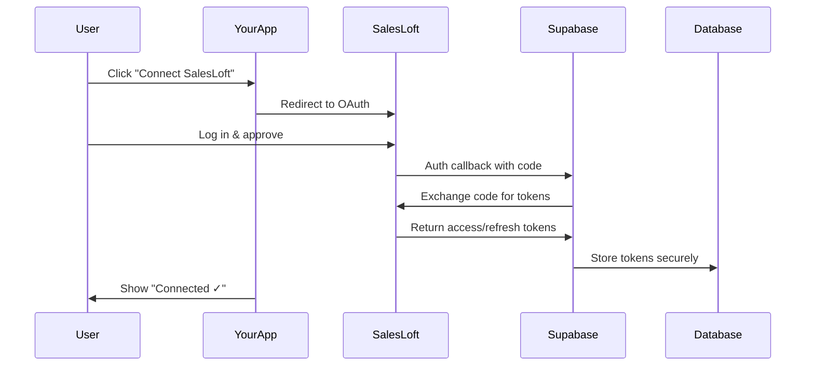

# SalesLoft Setup Guide

## Overview

SalesLoft is a comprehensive sales engagement platform that helps revenue teams execute and optimize their sales processes. This integration allows you to:
- Import sales activities (emails, calls, meetings) to track engagement
- Monitor cadence (sequence) enrollment and progression
- Track sales rep performance and account ownership
- Calculate engagement scores for ICP analysis

**Use Case:** "See which high-fit accounts are actively being worked by sales and their response rates"

**Why SalesLoft?**
- **Comprehensive activity tracking:** All touchpoints in one place
- **Cadence intelligence:** See who's in active sequences and their stage
- **Engagement analytics:** Opens, clicks, replies, meeting rates
- **Call recordings:** Access to call data and outcomes
- **Revenue insights:** Connect activities to pipeline impact

---

## Prerequisites

### Required
- **Active SalesLoft account** with API access
  - Professional or Enterprise tier (API included)
  - Advanced tier (legacy) also includes API
- **Admin or Developer role** to create OAuth applications
- **SalesLoft subdomain:** Your organization's URL (e.g., `app-us1.salesloft.com` or `app-eu1.salesloft.com`)

### Verify Your Access
1. Log into SalesLoft at your org's URL
2. Click **Settings** (gear icon, top right)
3. Navigate to **Platform** → **API**
4. If you see "API access not enabled", contact your SalesLoft admin or CSM

---

## Step 1: Create OAuth Application in SalesLoft

### Navigate to API Settings
1. **Log into SalesLoft** at your organization's URL
   - US: `https://app-us1.salesloft.com/`
   - EU: `https://app-eu1.salesloft.com/`
   - Or your custom domain

2. **Access Settings:**
   - Click **Settings** (gear icon in top right)
   - Or navigate to: Settings → Team → Settings

3. **Navigate to API:**
   - In left sidebar under **Platform** section
   - Click **API**
   - Or go to: `/app/admin/api_users`

### Create OAuth Application
1. Click **"Create New"** or **"Register Application"** button

2. **Fill in Application Details:**

   **Basic Information:**
   - **Name:** `ICP Signal Platform Integration`
   - **Description:** `Integration for syncing sales activities and cadence data`
   - **Application URL:** `https://dhyfbaptcprxxixgnpby.supabase.co` (your app domain)

   **OAuth Configuration:**
   - **Redirect URI:** `https://dhyfbaptcprxxixgnpby.supabase.co/functions/v1/oauth-callback`
     - **CRITICAL:** Must be exact URL
     - No trailing slashes
     - Must be `https://` (not `http://`)
   
   **Scopes (Permissions):**
   Select these scopes to access the necessary data:
   
   ✅ **Accounts:**
   - `accounts.read` - View account information
   - `accounts.write` - Update accounts (optional)
   
   ✅ **People (Contacts):**
   - `people.read` - View contact information
   - `people.write` - Update contacts (optional)
   
   ✅ **Cadences (Sequences):**
   - `cadences.read` - View cadence information
   - `cadence_memberships.read` - See who's enrolled in cadences
   
   ✅ **Activities:**
   - `activities.read` - View all activity types
   - `calls.read` - View call logs and recordings
   - `emails.read` - View email activities
   - `calendar_events.read` - View meetings
   
   ✅ **Users:**
   - `users.read` - View sales rep information
   
   ✅ **Meetings:**
   - `meetings.read` - View meeting details

   **Webhook URL (Optional but Recommended):**
   - URL: `https://dhyfbaptcprxxixgnpby.supabase.co/functions/v1/salesloft-webhook`
   - Events to subscribe to:
     - `activity.created` - New activities
     - `cadence_membership.changed` - Cadence updates
     - `person.updated` - Contact updates
     - `account.updated` - Account updates

3. **Click "Create Application"**

### Copy OAuth Credentials
After creating the application:

1. **Application Key** (Client ID)
   - Format: Long alphanumeric string
   - Copy and save securely

2. **Secret Key** (Client Secret)
   - Format: Long alphanumeric string
   - **IMPORTANT:** Copy immediately - you may not see it again
   - If lost, regenerate (will require reconfiguring integration)

3. **Note Your SalesLoft Domain:**
   - Example: `app-us1.salesloft.com` (US)
   - Example: `app-eu1.salesloft.com` (EU)
   - Needed for API calls

---

## Step 2: Add OAuth Credentials to Your Application

### Option A: Via Application UI (Recommended)
1. **Navigate to Settings**
   - In your application, click **Settings** (left sidebar)
   - Go to **External Integrations** tab

2. **Find SalesLoft Section**
   - Scroll to **"SalesLoft"** card
   - Click **"Connect"**

3. **Enter OAuth Credentials:**
   - **Client ID:** Paste Application Key from SalesLoft
   - **Client Secret:** Paste Secret Key from SalesLoft
   - **SalesLoft Domain:** Enter your domain
     - US: `app-us1.salesloft.com`
     - EU: `app-eu1.salesloft.com`
     - Or your custom domain
   - Click **"Save"**

4. **Initiate OAuth Flow:**
   - Click **"Authorize with SalesLoft"**
   - Redirected to SalesLoft login
   - Grant permissions to the application
   - Redirected back to your app
   - Status should show **"Connected ✓"**

### Option B: Via Supabase Secrets (Manual)
1. Go to [Supabase Dashboard](https://supabase.com/dashboard/project/dhyfbaptcprxxixgnpby/settings/functions)
2. Click **"Edge Function Secrets"**
3. Add these secrets:
   
   **Secret 1:**
   - **Name:** `SALESLOFT_CLIENT_ID`
   - **Value:** Your SalesLoft Application Key
   - Click "Save"
   
   **Secret 2:**
   - **Name:** `SALESLOFT_CLIENT_SECRET`
   - **Value:** Your SalesLoft Secret Key
   - Click "Save"

4. Complete OAuth flow via application UI (Step 2A, point 4)

---

## Step 3: Configure SalesLoft Integration

### Set Sync Preferences
1. **Settings** → **External Integrations** → **SalesLoft**

2. **Configure Data Sync:**

   **Activities to Import:**
   - ✅ Email activities (sent, opened, clicked, replied)
   - ✅ Call activities (attempted, completed, duration, outcome)
   - ✅ Meetings (scheduled, completed, no-shows)
   - ⚠️ Other activities (optional - may be noisy)

   **Sync Frequency:**
   - **Real-time:** Via webhooks (best, if configured)
   - **Hourly:** Recommended for most teams
   - **Every 6 hours:** For lower volume
   - **Daily:** Minimum recommended frequency
   - **Manual:** On-demand only

   **Historical Data:**
   - Last 90 days (default)
   - Last 180 days (for trend analysis)
   - All time (initial setup only, takes longer)

   **Activity Filters:**
   - Only sync activities for accounts in your database
   - Exclude test/demo accounts
   - Exclude archived cadences

### Map SalesLoft Fields to Your Schema
1. **Settings** → **External Integrations** → **SalesLoft** → **Field Mapping**

2. **Standard Mappings (Automatic):**
   - SalesLoft Account → Your Account (by domain or name)
   - SalesLoft Person → Your Lead (by email)
   - SalesLoft User (rep) → Your User (by email)

3. **Custom Field Mapping (Optional):**
   - Map SalesLoft custom fields to your schema
   - Example: `account.custom.revenue_segment` → `revenue_segment`

### Enable Engagement Scoring
Boost ICP scores for accounts with high engagement:

1. **Settings** → **Scoring Configuration** → **Engagement Bonuses**
2. Configure point values:
   - **Email reply:** +5 points
   - **Meeting booked:** +10 points
   - **Meeting completed:** +15 points
   - **Call connected:** +5 points
   - **Positive sentiment:** +5 points
   - **Cadence advanced to next stage:** +3 points

3. **Engagement Decay:**
   - Activities < 30 days: 100% weight
   - Activities 30-90 days: 50% weight
   - Activities > 90 days: 0% weight (ignored)

---

## How the Integration Works

### 1. OAuth Authentication
**Purpose:** Securely connect to SalesLoft

**Flow:**


**Tokens:**
- Access token (valid for 2 hours)
- Refresh token (automatically refresh access token)
- Stored in `integration_configs` table

### 2. Activity Sync Process
**Purpose:** Import sales activities for engagement tracking

**How it works:**
1. **Scheduled Job Runs** (e.g., hourly)

2. **Fetch Activities from SalesLoft:**
   ```
   GET https://api.salesloft.com/v2/activities.json
   ?updated_at[gt]=2024-01-15T00:00:00Z
   &per_page=100
   ```

3. **SalesLoft Returns Activities:**
   ```json
   {
     "data": [
       {
         "id": 12345,
         "type": "email",
         "activity_at": "2024-01-15T10:30:00Z",
         "subject": "Follow-up on demo",
         "person_id": 67890,
         "user_id": 111,
         "sentiment": "positive",
         "metadata": {
           "opened_at": "2024-01-15T10:45:00Z",
           "clicked_at": "2024-01-15T10:47:00Z",
           "replied_at": "2024-01-15T11:00:00Z"
         }
       },
       {
         "id": 12346,
         "type": "call",
         "activity_at": "2024-01-15T14:00:00Z",
         "duration": 900,
         "disposition": "Connected - Meeting Set",
         "person_id": 67890,
         "user_id": 111,
         "recording_url": "https://..."
       }
     ],
     "metadata": {
       "paging": {
         "next_page": 2
       }
     }
   }
   ```

4. **System Processes Each Activity:**
   - Fetch Person (contact) details from SalesLoft
   - Match Person to Lead in your database (by email)
   - Fetch Account details from SalesLoft
   - Match Account to your Account (by domain)
   - Create activity record in your database

5. **Store in Database:**
   ```sql
   INSERT INTO activities (
     account_id,
     lead_id,
     user_id,
     activity_type,
     activity_date,
     data_source,
     metadata
   ) VALUES (
     'account-uuid',
     'lead-uuid',
     'user-uuid',
     'email_reply',
     '2024-01-15T11:00:00Z',
     'salesloft',
     '{"subject": "...", "sentiment": "positive", "opened": true}'
   );
   ```

6. **Update Engagement Scores:**
   - Calculate engagement points from activities
   - Add to account's ICP score
   - Update "last activity" timestamp
   - Flag account as "actively being worked"

### 3. Cadence Enrollment Tracking
**Purpose:** See which accounts are in active sales cadences

**How it works:**
1. **Fetch Active Cadence Memberships:**
   ```
   GET https://api.salesloft.com/v2/cadence_memberships.json
   ?currently_on_cadence=true
   ```

2. **SalesLoft Returns Enrollments:**
   ```json
   {
     "data": [
       {
         "id": 789,
         "person_id": 67890,
         "cadence_id": 456,
         "current_step": 3,
         "added_at": "2024-01-10T00:00:00Z",
         "currently_on_cadence": true,
         "cadence": {
           "id": 456,
           "name": "Enterprise - Discovery Cadence",
           "total_steps": 10
         }
       }
     ]
   }
   ```

3. **Update Account Status:**
   - Mark account as "In Cadence"
   - Show cadence name and current step
   - Calculate cadence engagement (activities per step)
   - Display on account detail page

4. **Track Cadence Progression:**
   - Monitor when contacts advance to next step
   - Track drops from cadence (churned)
   - Identify successful cadences (high meeting rate)

### 4. Meeting Sync
**Purpose:** Import scheduled and completed meetings

**How it works:**
1. **Fetch Meetings:**
   ```
   GET https://api.salesloft.com/v2/calendar_events.json
   ?starts_at[gte]=2024-01-01
   ```

2. **Process Meeting Data:**
   - Scheduled meetings → Future events
   - Completed meetings → Activity records with +15 points
   - No-shows → Flag for follow-up task
   - Add meeting notes to account timeline

---

## API Rate Limits

### SalesLoft Rate Limits
- **Rate limit:** 600 requests/minute per org
- **Daily limit:** 50,000 requests/day per org
- **Burst capacity:** Up to 100 requests in short burst

### Handling Rate Limits
- Built-in rate limiting with exponential backoff
- Automatic retry on 429 responses
- Batch processing for bulk operations
- Pagination (100 records per page)

**Monitor Usage:**
- SalesLoft → Settings → Platform → API → Usage Dashboard
- Shows requests per hour/day
- Alerts when approaching limits

**Best Practices:**
- Schedule syncs during off-peak hours
- Use incremental sync (only changed records)
- Enable webhooks for real-time updates (reduces API calls)

---

## Testing Your Integration

### Pre-Test Checklist
- [ ] OAuth credentials added
- [ ] OAuth flow completed successfully
- [ ] Connection status shows "Connected ✓"
- [ ] At least 1 account with activities in SalesLoft

### Test 1: Connection Test
1. **Settings** → **External Integrations** → **SalesLoft**
2. Click **"Test Connection"**
3. **Expected Result:**
   - ✅ "SalesLoft connection successful"
   - Shows your SalesLoft domain
   - Status: Green "Connected"
   - Last sync timestamp
4. **If Failed:** See Troubleshooting

### Test 2: Activity Sync
1. **Create Test Activity in SalesLoft:**
   - Send an email to a person
   - Or log a call
   - Wait 1-2 minutes for processing

2. **Trigger Manual Sync:**
   - Settings → SalesLoft → **"Sync Now"**

3. **Expected Result:**
   - Progress indicator: "Syncing activities..."
   - Result: "Synced 3 new activities"
   - Go to **Activities** page
   - See your test activity listed

4. **Verify Activity Details:**
   - Activity type correct (email/call)
   - Date/time accurate
   - Linked to correct account and lead
   - Source: "SalesLoft"

### Test 3: Cadence Enrollment
1. **Add Person to Cadence in SalesLoft:**
   - Select any active cadence
   - Enroll a person
   - Note the person's account domain

2. **Sync Cadence Data:**
   - Settings → SalesLoft → **"Sync Cadences"**

3. **Expected Result:**
   - Go to **Accounts** page
   - Search for the account
   - Badge shows: "In Cadence: [Cadence Name]"
   - Click account → "SalesLoft" tab
   - See: Step 1 of X, Started date

### Test 4: Meeting Sync
1. **Schedule Meeting in SalesLoft:**
   - Create a meeting with a person
   - Set future date

2. **Sync Meetings:**
   - Settings → SalesLoft → **"Sync Meetings"**

3. **Expected Result:**
   - Meeting in your calendar
   - Shows title, date, attendees, account
   - Status: "Scheduled"

4. **Mark Meeting Completed:**
   - In SalesLoft, mark meeting as held
   - Add notes
   - Sync again

5. **Verify Update:**
   - Meeting status: "Completed"
   - Notes visible
   - Account gets +15 points
   - Activity record created

### Test 5: Engagement Scoring
1. **Create Multiple Activities:**
   - 2 emails (1 replied)
   - 1 call (connected)
   - 1 meeting (completed)

2. **Sync All Data:**
   - Settings → SalesLoft → "Sync Now"

3. **Check Engagement Score:**
   - Account detail page → "Engagement" section
   - Breakdown:
     - Email reply: +5
     - Call connected: +5
     - Meeting completed: +15
     - **Total: +25 engagement points**

4. **Verify ICP Score Increase:**
   - Original: 70
   - With engagement: 95 (70 + 25)
   - Moved to "High Fit" tier

---

## Troubleshooting

### Error: "OAuth Authorization Failed"
**Symptoms:**
- Redirect error after login
- "Invalid request" or "Authorization denied"

**Solutions:**
1. **Verify Redirect URI:**
   - SalesLoft OAuth App settings
   - Must be exact: `https://dhyfbaptcprxxixgnpby.supabase.co/functions/v1/oauth-callback`
   - No typos, trailing slashes

2. **Check Scopes:**
   - Ensure all required scopes selected
   - See Step 1 for complete list

3. **Verify Credentials:**
   - Re-copy Client ID and Secret
   - Update in Settings
   - Retry OAuth flow

4. **Check User Permissions:**
   - Need admin or developer role
   - Contact SalesLoft admin if needed

### Error: "Access Token Expired"
**Symptoms:**
- Sync fails with 401 Unauthorized
- "Token expired" message

**Solutions:**
1. **Auto-refresh should handle this:**
   - System uses refresh token automatically
   - No action needed usually

2. **If auto-refresh fails:**
   - Settings → SalesLoft → "Reconnect"
   - Complete OAuth again
   - New tokens issued

3. **Check refresh token:**
   - Verify stored in database
   - If missing, need to re-authorize

### Error: "Rate Limit Exceeded"
**Symptoms:**
- 429 error during sync
- "Too many requests" message

**Solutions:**
1. **System auto-retries** - Wait and it will resume
2. **If persistent:**
   - Reduce sync frequency (hourly → every 6 hours)
   - Check other integrations using SalesLoft API
   - Monitor usage in SalesLoft dashboard

3. **Request limit increase:**
   - Contact SalesLoft support
   - Explain use case
   - May increase limits for your org

### Error: "Person/Account Not Found"
**Symptoms:**
- Activities synced but not linked
- "Could not match SalesLoft person to lead"

**Solutions:**
1. **Verify email matching:**
   - SalesLoft Person email must match Lead email exactly
   - Check for typos

2. **Verify domain matching:**
   - SalesLoft Account domain vs Your Account domain
   - Update if mismatch

3. **Manual matching:**
   - Settings → Data Mapping → Manual Matches
   - Link SalesLoft records to your records

### Error: "Webhook Not Receiving Events"
**Symptoms:**
- Real-time sync not working
- Webhooks show failed in SalesLoft

**Solutions:**
1. **Verify webhook URL:**
   - SalesLoft → API → Webhooks
   - Should be: `https://dhyfbaptcprxxixgnpby.supabase.co/functions/v1/salesloft-webhook`

2. **Check endpoint accessibility:**
   - Test with curl/Postman
   - Should return 200

3. **Review webhook logs:**
   - Supabase → Functions → salesloft-webhook → Logs
   - Check for errors

---

## Best Practices

### 1. Sync Strategy
- **Webhooks + Hourly sync:** Best of both worlds
  - Webhooks for real-time critical events
  - Hourly sync as backup for missed webhooks
- **Daily sync:** Minimum for most teams
- **Incremental only:** Only fetch changed records

### 2. Activity Prioritization
**Focus on high-value activities:**
- ✅ Email replies (high intent)
- ✅ Meetings (highest intent)
- ✅ Connected calls (medium intent)
- ⚠️ Email opens (low intent, optional)
- ❌ Email bounces (not useful)

### 3. Cadence Intelligence
**Use cadence data for prioritization:**
- Accounts in cadence = actively worked
- Early cadence stages = nurturing
- Late cadence stages = ready to close
- Dropped from cadence = flag for re-engagement

### 4. Attribution
**Track sales rep ownership:**
- Most recent activity = primary owner
- All reps with activities = team attribution
- Use for territory management
- Use for commission/quota

### 5. Data Hygiene
**Keep SalesLoft data clean:**
- Merge duplicate people
- Archive old cadences
- Remove test accounts
- Validate email addresses

---

## Additional Resources

### SalesLoft Documentation
- [SalesLoft API Docs](https://developers.salesloft.com/api.html)
- [OAuth Guide](https://developers.salesloft.com/oauth.html)
- [Webhooks](https://developers.salesloft.com/webhooks.html)
- [Rate Limits](https://developers.salesloft.com/api.html#rate-limiting)

### Internal Documentation
- [Master Integration Guide](./MASTER_INTEGRATION_GUIDE.md)
- [Outreach Setup](./OUTREACH_SETUP.md) - Compare features
- [Salesforce Setup](./SALESFORCE_OAUTH_SETUP.md) - For CRM data
- [Troubleshooting](./TROUBLESHOOTING_INTEGRATIONS.md)

### Support
- **SalesLoft Support:** support@salesloft.com
- **Developer Help:** developers@salesloft.com
- **Help Center:** https://help.salesloft.com/
- **Application Support:** Settings → Integration Health

---

## Success Checklist

After setup, you should be able to:
- [ ] Connect via OAuth successfully
- [ ] Sync email, call, meeting activities
- [ ] View activities on account pages
- [ ] Track cadence enrollments
- [ ] Calculate engagement scores
- [ ] Attribute accounts to reps
- [ ] Identify hot accounts (high engagement)
- [ ] Monitor sync health

---

## Next Steps

1. **Set Up Groove** - [Groove Setup Guide](./GROOVE_SETUP.md) - If also using
2. **Configure Engagement Scoring** - Settings → Scoring Configuration
3. **Enable Scheduled Sync** - [CRON Setup](./CRON_SETUP_INSTRUCTIONS.md)
4. **Create Activity Dashboards** - Rep performance, account engagement
5. **Set Up Alerts** - High-fit account activity notifications

---

**Last Updated:** 2025-11-06  
**Version:** 1.0  
**Maintained By:** Integration Team
