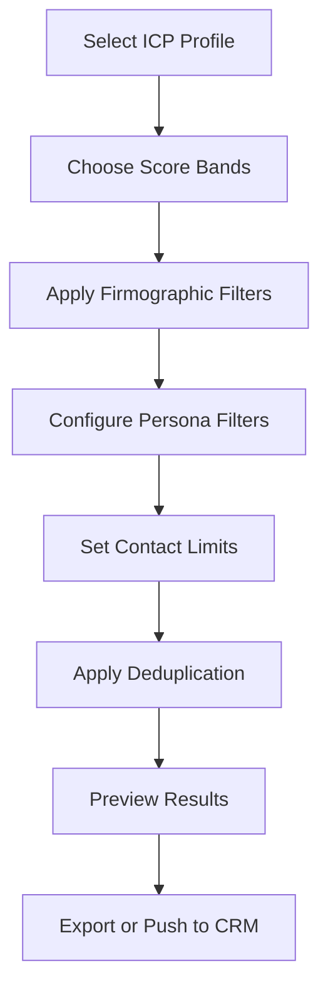

# Campaign Builder Guide

## Overview

The Campaign Builder is LaunchPulse's powerful tool for creating targeted outbound campaigns based on your ICP profiles and scoring results. It allows you to filter, segment, and export high-quality contact lists for your sales and marketing efforts.

## Table of Contents

1. [Accessing the Campaign Builder](#accessing-the-campaign-builder)
2. [Campaign Building Workflow](#campaign-building-workflow)
3. [ICP and Score Band Selection](#icp-and-score-band-selection)
4. [Contact Filtering](#contact-filtering)
5. [Deduplication Strategies](#deduplication-strategies)
6. [Export Options](#export-options)
7. [Campaign Naming Conventions](#campaign-naming-conventions)
8. [Best Practices](#best-practices)
9. [Troubleshooting](#troubleshooting)

---

## Accessing the Campaign Builder

Navigate to the Campaign Builder from:
- **Main Navigation**: Click "Campaigns" in the left sidebar
- **Account View**: Click "Add to Campaign" from the bulk actions menu
- **Executive Dashboard**: Click "Quick Campaign" from any metric card

## Campaign Building Workflow

### Step-by-Step Process



### Typical Workflow Timeline

| Step | Time Required | Description |
|------|---------------|-------------|
| ICP Selection | 30 seconds | Choose your target ICP profile |
| Score Band Filtering | 1 minute | Select A/B/C/D score bands |
| Firmographic Filters | 2-3 minutes | Apply geography, industry, size filters |
| Persona Configuration | 2-3 minutes | Set job titles, seniority, departments |
| Deduplication Setup | 1 minute | Choose deduplication strategy |
| Preview & Export | 1-2 minutes | Review and export campaign |

**Total Time**: 7-10 minutes for a comprehensive campaign

---

## ICP and Score Band Selection

### Selecting Your ICP Profile

The Campaign Builder starts with ICP selection:

```typescript
// Available ICPs displayed with key metrics
ICP: "Enterprise Financial Services"
├── Total Accounts: 2,847
├── High Fit (A): 312 accounts
├── Medium-High Fit (B): 891 accounts
├── Medium Fit (C): 1,203 accounts
└── Low Fit (D): 441 accounts
```

**ICP Selection Options:**
- **Single ICP**: Target one specific profile
- **Multiple ICPs**: Combine multiple profiles (enterprise feature)
- **All ICPs**: Include all profiles for broad outreach

### Score Band Filtering

Score bands represent fit quality:

| Band | Score Range | Typical Use Case |
|------|-------------|------------------|
| **A (High Fit)** | 80-100 | SDR outreach, high-priority accounts |
| **B (Medium-High)** | 60-79 | Marketing campaigns, nurture sequences |
| **C (Medium)** | 40-59 | Awareness campaigns, content marketing |
| **D (Low Fit)** | 0-39 | Exclude from campaigns |

**Recommended Configurations:**

**Sales Outreach Campaign:**
```
Score Bands: A + B
Target: High-quality accounts for direct sales engagement
```

**Marketing Nurture Campaign:**
```
Score Bands: B + C
Target: Medium-fit accounts for automated nurture
```

**Brand Awareness Campaign:**
```
Score Bands: A + B + C
Target: All qualified accounts for broad reach
```

---

## Contact Filtering

### Persona Filter Configuration

Build precise contact lists using multiple persona dimensions:

#### 1. Job Titles

**Common Title Patterns:**
- **C-Level**: CEO, CFO, CTO, COO, CMO, CISO
- **VP-Level**: VP of Engineering, VP of Sales, VP of Marketing
- **Director-Level**: Director of IT, Director of Operations
- **Manager-Level**: IT Manager, Product Manager, Engineering Manager

**Title Matching:**
- Exact match: "Chief Financial Officer"
- Contains: "Financial" (matches CFO, Finance Director, etc.)
- Multiple titles: Use comma-separated list

**Example Configuration:**
```json
{
  "job_titles": [
    "Chief Technology Officer",
    "VP of Engineering",
    "Director of IT",
    "Engineering Manager"
  ],
  "title_match_type": "contains" // or "exact"
}
```

#### 2. Seniority Levels

| Level | Definition | Typical Titles |
|-------|------------|----------------|
| **C-Suite** | Executive leadership | CEO, CFO, CTO, COO |
| **VP** | Vice President level | VP of Sales, VP Engineering |
| **Director** | Senior management | Director of IT, Director Marketing |
| **Manager** | Middle management | Product Manager, Sales Manager |
| **IC (Individual Contributor)** | Non-management | Engineer, Analyst, Specialist |

**Recommended Seniority by Campaign Type:**
- **Enterprise Sales**: C-Suite + VP
- **Mid-Market Sales**: VP + Director
- **Product Adoption**: Manager + IC
- **Influencer Marketing**: All levels

#### 3. Departments

**Standard Departments:**
- **Engineering/IT**: Technical decision-makers
- **Sales**: Revenue-focused roles
- **Marketing**: Campaign and brand roles
- **Operations**: Process and efficiency roles
- **Finance**: Budget and procurement roles
- **HR**: People and culture roles

**Department-Based Strategies:**

**IT/Engineering Campaign:**
```json
{
  "departments": ["Engineering", "IT", "Technology"],
  "seniority": ["C-Suite", "VP", "Director"],
  "job_titles": ["CTO", "VP Engineering", "Director of IT"]
}
```

**Finance/Procurement Campaign:**
```json
{
  "departments": ["Finance", "Procurement", "Operations"],
  "seniority": ["C-Suite", "VP", "Director"],
  "job_titles": ["CFO", "VP Finance", "Director Procurement"]
}
```

#### 4. Decision Roles

Filter by role in the buying process:

| Role | Description | Influence Level |
|------|-------------|-----------------|
| **Economic Buyer** | Budget authority | ★★★★★ Critical |
| **Technical Buyer** | Technical evaluation | ★★★★☆ High |
| **Champion** | Internal advocate | ★★★★☆ High |
| **Influencer** | Input provider | ★★★☆☆ Medium |
| **End User** | Product user | ★★☆☆☆ Low |

### Firmographic Filters

Apply account-level filters to refine your campaign:

#### Geography Filters

**Country Selection:**
- Single country: "United States"
- Multiple countries: ["United States", "Canada", "United Kingdom"]
- Region: "North America" (includes US, Canada, Mexico)

**State/Province Filtering:**
```json
{
  "countries": ["United States"],
  "states": ["California", "New York", "Texas"]
}
```

**City-Level Targeting:**
```json
{
  "countries": ["United States"],
  "cities": ["San Francisco", "New York", "Austin"]
}
```

#### Industry Filters

**Normalized Industries:**
- Technology & Software
- Financial Services
- Healthcare
- Manufacturing
- Retail & E-commerce
- Professional Services
- Education
- Government

**Sub-Industry Filtering:**
```json
{
  "industry": "Technology & Software",
  "sub_industries": ["SaaS", "Cloud Infrastructure", "Cybersecurity"]
}
```

#### Company Size Filters

**Employee Count Ranges:**
| Range | Category | Use Case |
|-------|----------|----------|
| 1-10 | Micro | Startups, agencies |
| 11-50 | Small | Small businesses |
| 51-200 | Medium | Growth-stage companies |
| 201-1,000 | Mid-Market | Established companies |
| 1,001-5,000 | Large | Enterprise |
| 5,001+ | Enterprise | Global corporations |

**Revenue Ranges:**
- $0-$1M
- $1M-$10M
- $10M-$50M
- $50M-$100M
- $100M-$500M
- $500M-$1B
- $1B+

#### Technology Stack Filters

Filter accounts using specific technologies:

**Common Tech Stack Categories:**
- **CRM**: Salesforce, HubSpot, Pipedrive
- **Marketing Automation**: Marketo, Pardot, ActiveCampaign
- **Analytics**: Google Analytics, Mixpanel, Amplitude
- **Cloud**: AWS, Azure, GCP
- **Developer Tools**: GitHub, GitLab, Jira

**Example Tech Stack Filter:**
```json
{
  "required_tech": ["Salesforce", "Slack"],
  "exclude_tech": ["HubSpot"]
}
```

---

## Deduplication Strategies

### Why Deduplication Matters

Without deduplication, contacts may appear in multiple campaigns, leading to:
- Over-communication and spam complaints
- Confused messaging across campaigns
- Wasted outreach resources
- Damaged brand reputation

### Deduplication Options

#### 1. **Global Deduplication** (Recommended)

Removes contacts who have been exported in **any** previous campaign within the lookback period.

```json
{
  "strategy": "global",
  "lookback_days": 90
}
```

**When to Use:**
- Default for most campaigns
- Prevents contact fatigue
- Ensures consistent messaging

**Lookback Period Options:**
- 30 days: Aggressive outreach
- 90 days: Standard (recommended)
- 180 days: Conservative approach
- 365 days: Annual campaigns only

#### 2. **Campaign-Specific Deduplication**

Removes contacts exported in **specific previous campaigns** only.

```json
{
  "strategy": "campaign_specific",
  "exclude_campaigns": ["Q4_Enterprise_Outreach", "Holiday_Campaign_2024"]
}
```

**When to Use:**
- Multi-touch sequences
- Different value propositions
- Separate product lines

#### 3. **ICP-Specific Deduplication**

Removes contacts exported for the **same ICP** only (allows cross-ICP outreach).

```json
{
  "strategy": "icp_specific",
  "lookback_days": 60
}
```

**When to Use:**
- Multiple ICPs with distinct messaging
- Different product offerings
- Segmented sales teams

#### 4. **No Deduplication**

Exports all contacts without checking previous campaigns.

⚠️ **Warning:** Only use for testing or special circumstances.

### Deduplication Best Practices

1. **Set appropriate lookback periods** based on sales cycle length
2. **Use global deduplication** as default
3. **Document exceptions** when using campaign-specific deduplication
4. **Monitor export history** to track contact frequency
5. **Respect consent registry** for GDPR/CAN-SPAM compliance

---

## Contact Limits

### Max Contacts Per Account

Control the number of contacts exported from each account:

| Limit | Use Case |
|-------|----------|
| **1 contact** | Highly targeted, single-threaded outreach |
| **2-3 contacts** | Multi-threaded sales (recommended) |
| **5+ contacts** | Large enterprise, committee-based buying |
| **Unlimited** | Marketing campaigns, awareness |

**Recommended Settings:**

**Enterprise Sales (ABM):**
```json
{
  "max_contacts_per_account": 3,
  "prioritization": "seniority_desc"
}
```

**Mid-Market Sales:**
```json
{
  "max_contacts_per_account": 2,
  "prioritization": "decision_role"
}
```

**Marketing Campaigns:**
```json
{
  "max_contacts_per_account": 5,
  "prioritization": "engagement_score"
}
```

### Contact Prioritization

When limiting contacts per account, prioritize by:

1. **Seniority**: Highest-level contacts first
2. **Decision Role**: Economic buyers first
3. **Engagement Score**: Most engaged contacts first
4. **Reachability Score**: Contacts with highest email deliverability
5. **Data Completeness**: Most complete contact records

---

## Export Options

### Export Formats

#### 1. **CSV Export** (Most Common)

Downloads a CSV file with all campaign contacts and account data.

**Standard Fields Included:**
- Contact: First Name, Last Name, Email, Phone, Job Title
- Account: Company Name, Domain, Industry, Employee Count, Country
- Scoring: Fit Score, Score Band, ICP Name
- Enrichment: LinkedIn URLs, Technologies, Funding Data

**CSV Configuration:**
```json
{
  "format": "csv",
  "fields": "all", // or specify custom fields
  "filename": "Q1_Enterprise_Campaign_2024.csv"
}
```

**Custom Field Selection:**
```json
{
  "format": "csv",
  "fields": [
    "email",
    "first_name",
    "last_name",
    "job_title",
    "company_name",
    "fit_score"
  ]
}
```

#### 2. **CRM Push** (Salesforce/HubSpot)

Automatically creates campaigns and adds contacts in your CRM.

**Salesforce Push:**
```json
{
  "destination": "salesforce",
  "create_campaign": true,
  "campaign_name": "Q1_Enterprise_Outreach",
  "campaign_type": "Email",
  "member_status": "Sent"
}
```

**HubSpot Push:**
```json
{
  "destination": "hubspot",
  "create_list": true,
  "list_name": "Q1_Enterprise_Campaign",
  "update_properties": true
}
```

**Field Mapping Options:**
- Map LaunchPulse fields to CRM custom fields
- Sync fit scores to CRM
- Update account fields with enrichment data

#### 3. **API Export** (Advanced)

Send campaign data to external tools via API.

**Zapier Integration:**
```json
{
  "destination": "zapier",
  "webhook_url": "https://hooks.zapier.com/...",
  "batch_size": 100
}
```

**Supported Integrations:**
- Outreach.io
- SalesLoft
- Apollo.io
- Clay
- Custom webhooks

### Post-Export Actions

After exporting a campaign:

1. **Campaign Snapshot Created**
   - Record stored in `campaign_snapshots` table
   - Tracks: Export date, contact count, filters applied
   - Enables deduplication for future campaigns

2. **Export History Updated**
   - Viewable in Settings → Campaign History
   - Shows all previous exports with metrics

3. **CRM Sync Status** (if applicable)
   - Real-time sync status indicator
   - Error logs if sync fails
   - Retry mechanism available

---

## Campaign Naming Conventions

### Automated Campaign Names

LaunchPulse auto-generates campaign names using this format:

```
{ICP_Segment}_{Region}_{Signal}_{Week}
```

**Example:**
```
Enterprise_FinServ_NA_HighIntent_W48
```

**Components:**
- **ICP Segment**: Short ICP name (e.g., "Enterprise_FinServ")
- **Region**: Geographic focus (e.g., "NA", "EMEA", "APAC")
- **Signal**: Campaign trigger (e.g., "HighIntent", "NewFunding", "TechStack")
- **Week**: Week number (e.g., "W48" for week 48 of year)

### Custom Campaign Names

You can override auto-generated names:

**Best Practices:**
- Use consistent naming scheme across campaigns
- Include date or quarter for tracking
- Reference ICP or segment
- Indicate campaign purpose

**Examples:**
```
Q1_2024_Enterprise_ABM_Campaign
Holiday_Promo_SMB_December
Product_Launch_TechStack_Salesforce
```

### Campaign Registry

All campaign names are registered in the `campaign_naming_registry` table to prevent duplicates.

---

## Best Practices

### 1. Start with High-Fit Accounts

**Recommended First Campaign:**
```json
{
  "icp": "Primary ICP",
  "score_bands": ["A"],
  "max_contacts": 2,
  "seniority": ["C-Suite", "VP"],
  "deduplication": "global_90_days"
}
```

Focus on A-band accounts with executive contacts for highest conversion rates.

### 2. Multi-Touch Campaigns

Create sequences targeting different score bands:

**Week 1:** A-band accounts (executives)
**Week 2:** B-band accounts (directors)
**Week 3:** A-band accounts (managers) - second touch
**Week 4:** B-band accounts (different persona)

### 3. Geographic Segmentation

Create separate campaigns by geography for:
- Timezone-appropriate outreach
- Regional messaging
- Localized offers
- Sales territory alignment

### 4. Persona-Specific Messaging

Build campaigns for each persona:

**Technical Buyer Campaign:**
```json
{
  "persona": {
    "job_titles": ["CTO", "VP Engineering", "Director IT"],
    "departments": ["Engineering", "IT"]
  },
  "messaging": "Technical benefits, security, integration"
}
```

**Economic Buyer Campaign:**
```json
{
  "persona": {
    "job_titles": ["CFO", "VP Finance", "COO"],
    "departments": ["Finance", "Operations"]
  },
  "messaging": "ROI, cost savings, business value"
}
```

### 5. Monitor Campaign Performance

Track key metrics:
- **Delivery Rate**: Email deliverability percentage
- **Open Rate**: Email engagement
- **Reply Rate**: Outreach effectiveness
- **Meeting Booked**: Conversion metric
- **Pipeline Generated**: Revenue impact

### 6. Iterate Based on Results

**If low response rates:**
- Increase score band threshold (only A-band)
- Refine persona filters
- Improve messaging

**If high unsubscribe rates:**
- Increase deduplication lookback period
- Review consent registry
- Reduce contact frequency

---

## Troubleshooting

### Common Issues

#### Issue: "No contacts found"

**Causes:**
- Filters too restrictive
- No contacts match persona criteria
- All contacts previously exported (deduplication)

**Solutions:**
1. Relax persona filters (include more job titles)
2. Expand score bands (include B or C)
3. Review deduplication settings
4. Check data quality (run contact backfill)

#### Issue: "Low contact count per account"

**Causes:**
- Accounts lack contact data
- Persona filters too narrow
- Contact discovery not run

**Solutions:**
1. Run contact backfill enrichment
2. Broaden job title criteria
3. Check enrichment provider status
4. Verify CRM sync for contact import

#### Issue: "CRM sync failed"

**Causes:**
- Invalid credentials
- Rate limit exceeded
- Field mapping errors
- CRM API issues

**Solutions:**
1. Verify CRM credentials in Settings
2. Check rate limits (wait and retry)
3. Review field mapping configuration
4. Check CRM API status page
5. View sync logs in Settings → Integration Health

#### Issue: "Duplicate contacts in export"

**Causes:**
- Deduplication disabled
- Multiple personas match same contact
- Data quality issues (duplicate records)

**Solutions:**
1. Enable global deduplication
2. Run duplicate contact merger in Settings
3. Review persona filter overlap
4. Check identity registry for duplicates

### Getting Help

- **Documentation**: [Full Integration Guides](../05_Integrations/)
- **Support Email**: support@launchpulse.io
- **Slack Channel**: #campaign-builder
- **Knowledge Base**: help.launchpulse.io

---

## Related Documentation

- [ICP Manager Guide](./ICP_Manager_Guide.md)
- [Lead Management Guide](./Lead_Management_Guide.md)
- [Scoring Insights Guide](./Scoring_Insights_Guide.md)
- [CRM Quick Connect](../02_Quick_Start/CRM_Quick_Connect.md)
- [Campaign Export Quick Start](../02_Quick_Start/Campaign_Export_Quick_Start.md)

---

**Last Updated**: 2024-01-15  
**Version**: 1.0
